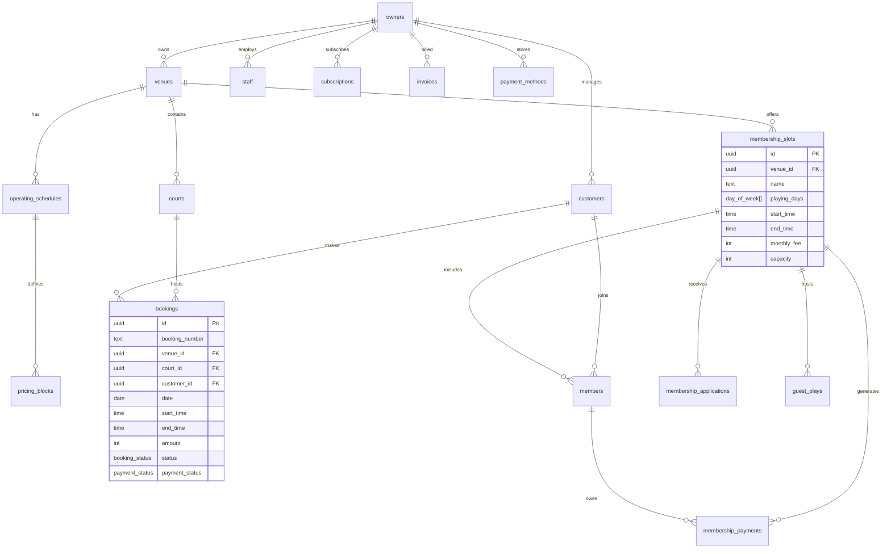

# Badminton Manager — Database Design (Supabase / PostgreSQL)

## 1. Design Principles

- Every table includes `id` (UUID, PK), `created_at`, `updated_at` audit fields
- Soft deletes via `deleted_at` timestamp (nullable)
- All foreign keys enforce referential integrity
- Row Level Security (RLS) on every table
- ENUMs for status fields to enforce valid states
- Indexes on frequently queried/filtered columns
- Multi-venue support baked into schema (every entity scoped to venue)

---

## 2. Enums

```sql
-- Authentication & Roles
CREATE TYPE user_role AS ENUM ('owner', 'staff', 'player');
CREATE TYPE staff_permission AS ENUM ('bookings', 'members', 'payments', 'reports', 'settings');

-- Booking & Court
CREATE TYPE booking_status AS ENUM ('upcoming', 'ongoing', 'completed', 'cancelled');
CREATE TYPE payment_status AS ENUM ('paid', 'partial', 'unpaid');
CREATE TYPE slot_type AS ENUM ('available', 'booked', 'coaching', 'tournament', 'maintenance', 'blocked');
CREATE TYPE booking_source AS ENUM ('online', 'offline', 'walk_in', 'membership');
CREATE TYPE court_type AS ENUM ('wooden', 'synthetic', 'cement', 'acrylic', 'mat');

-- Membership
CREATE TYPE membership_pay_status AS ENUM ('paid', 'due', 'overdue');
CREATE TYPE skill_level AS ENUM ('beginner', 'intermediate', 'advanced', 'recreational');
CREATE TYPE application_status AS ENUM ('pending', 'accepted', 'rejected', 'invited_guest');
CREATE TYPE guest_play_status AS ENUM ('upcoming', 'completed', 'accepted_member', 'rejected');

-- Payments
CREATE TYPE payment_mode AS ENUM ('cash', 'upi', 'google_pay', 'phonepe', 'bank_transfer', 'cheque', 'card', 'online');

-- Subscription
CREATE TYPE subscription_plan AS ENUM ('free', 'pro', 'enterprise');
CREATE TYPE invoice_status AS ENUM ('paid', 'pending', 'failed', 'refunded');

-- Days
CREATE TYPE day_of_week AS ENUM ('mon', 'tue', 'wed', 'thu', 'fri', 'sat', 'sun');
```

---

## 3. Tables

### 3.1 Core Entity Tables

```sql
-- ═══════════════════════════════════════════════════════════════
-- OWNERS (extends Supabase auth.users)
-- ═══════════════════════════════════════════════════════════════
CREATE TABLE owners (
  id            UUID PRIMARY KEY REFERENCES auth.users(id) ON DELETE CASCADE,
  full_name     TEXT NOT NULL,
  phone         TEXT NOT NULL UNIQUE,
  email         TEXT,
  avatar_url    TEXT,
  business_name TEXT NOT NULL,
  created_at    TIMESTAMPTZ NOT NULL DEFAULT NOW(),
  updated_at    TIMESTAMPTZ NOT NULL DEFAULT NOW(),
  deleted_at    TIMESTAMPTZ
);

CREATE INDEX idx_owners_phone ON owners(phone);

-- ═══════════════════════════════════════════════════════════════
-- VENUES
-- ═══════════════════════════════════════════════════════════════
CREATE TABLE venues (
  id              UUID PRIMARY KEY DEFAULT gen_random_uuid(),
  owner_id        UUID NOT NULL REFERENCES owners(id) ON DELETE CASCADE,
  name            TEXT NOT NULL,
  address         TEXT,
  city            TEXT,
  state           TEXT,
  pincode         TEXT,
  latitude        DECIMAL(9,6),
  longitude       DECIMAL(9,6),
  contact_phone   TEXT,
  contact_email   TEXT,
  court_type      court_type,
  amenities       TEXT[] DEFAULT '{}',           -- Array of amenity names
  photos          TEXT[] DEFAULT '{}',           -- Array of storage URLs
  is_active       BOOLEAN NOT NULL DEFAULT TRUE,
  created_at      TIMESTAMPTZ NOT NULL DEFAULT NOW(),
  updated_at      TIMESTAMPTZ NOT NULL DEFAULT NOW(),
  deleted_at      TIMESTAMPTZ
);

CREATE INDEX idx_venues_owner ON venues(owner_id);

-- ═══════════════════════════════════════════════════════════════
-- COURTS
-- ═══════════════════════════════════════════════════════════════
CREATE TABLE courts (
  id          UUID PRIMARY KEY DEFAULT gen_random_uuid(),
  venue_id    UUID NOT NULL REFERENCES venues(id) ON DELETE CASCADE,
  name        TEXT NOT NULL,                     -- e.g., "Court 1"
  sort_order  INTEGER NOT NULL DEFAULT 0,
  is_active   BOOLEAN NOT NULL DEFAULT TRUE,
  created_at  TIMESTAMPTZ NOT NULL DEFAULT NOW(),
  updated_at  TIMESTAMPTZ NOT NULL DEFAULT NOW(),
  deleted_at  TIMESTAMPTZ
);

CREATE INDEX idx_courts_venue ON courts(venue_id);

-- ═══════════════════════════════════════════════════════════════
-- STAFF
-- ═══════════════════════════════════════════════════════════════
CREATE TABLE staff (
  id          UUID PRIMARY KEY DEFAULT gen_random_uuid(),
  user_id     UUID REFERENCES auth.users(id) ON DELETE SET NULL,
  owner_id    UUID NOT NULL REFERENCES owners(id) ON DELETE CASCADE,
  venue_id    UUID REFERENCES venues(id) ON DELETE SET NULL, -- NULL = all venues
  full_name   TEXT NOT NULL,
  phone       TEXT NOT NULL,
  role_name   TEXT NOT NULL DEFAULT 'Staff',
  permissions staff_permission[] DEFAULT '{}',
  is_active   BOOLEAN NOT NULL DEFAULT TRUE,
  created_at  TIMESTAMPTZ NOT NULL DEFAULT NOW(),
  updated_at  TIMESTAMPTZ NOT NULL DEFAULT NOW(),
  deleted_at  TIMESTAMPTZ
);

CREATE INDEX idx_staff_owner ON staff(owner_id);
```

### 3.2 Schedule & Pricing

```sql
-- ═══════════════════════════════════════════════════════════════
-- OPERATING SCHEDULES (per venue per day)
-- ═══════════════════════════════════════════════════════════════
CREATE TABLE operating_schedules (
  id          UUID PRIMARY KEY DEFAULT gen_random_uuid(),
  venue_id    UUID NOT NULL REFERENCES venues(id) ON DELETE CASCADE,
  day_of_week day_of_week NOT NULL,
  is_closed   BOOLEAN NOT NULL DEFAULT FALSE,
  is_24h      BOOLEAN NOT NULL DEFAULT FALSE,
  created_at  TIMESTAMPTZ NOT NULL DEFAULT NOW(),
  updated_at  TIMESTAMPTZ NOT NULL DEFAULT NOW(),

  UNIQUE(venue_id, day_of_week)
);

-- ═══════════════════════════════════════════════════════════════
-- PRICING BLOCKS (time-based pricing within a day)
-- ═══════════════════════════════════════════════════════════════
CREATE TABLE pricing_blocks (
  id              UUID PRIMARY KEY DEFAULT gen_random_uuid(),
  schedule_id     UUID NOT NULL REFERENCES operating_schedules(id) ON DELETE CASCADE,
  start_time      TIME NOT NULL,
  end_time        TIME NOT NULL,
  price_per_hour  INTEGER NOT NULL,              -- in smallest currency unit (paise)
  court_ids       UUID[] DEFAULT '{}',           -- empty = all courts in venue
  is_active       BOOLEAN NOT NULL DEFAULT TRUE,
  sort_order      INTEGER NOT NULL DEFAULT 0,
  created_at      TIMESTAMPTZ NOT NULL DEFAULT NOW(),
  updated_at      TIMESTAMPTZ NOT NULL DEFAULT NOW(),

  CONSTRAINT valid_time_range CHECK (end_time > start_time)
);

CREATE INDEX idx_pricing_schedule ON pricing_blocks(schedule_id);
```

### 3.3 Bookings & Customers

```sql
-- ═══════════════════════════════════════════════════════════════
-- CUSTOMERS
-- ═══════════════════════════════════════════════════════════════
CREATE TABLE customers (
  id            UUID PRIMARY KEY DEFAULT gen_random_uuid(),
  owner_id      UUID NOT NULL REFERENCES owners(id) ON DELETE CASCADE,
  user_id       UUID REFERENCES auth.users(id),  -- linked if player has an account
  full_name     TEXT NOT NULL,
  phone         TEXT NOT NULL,
  email         TEXT,
  notes         TEXT,
  total_visits  INTEGER NOT NULL DEFAULT 0,
  total_spent   INTEGER NOT NULL DEFAULT 0,       -- paise
  created_at    TIMESTAMPTZ NOT NULL DEFAULT NOW(),
  updated_at    TIMESTAMPTZ NOT NULL DEFAULT NOW(),
  deleted_at    TIMESTAMPTZ,

  UNIQUE(owner_id, phone)
);

CREATE INDEX idx_customers_owner ON customers(owner_id);
CREATE INDEX idx_customers_phone ON customers(phone);

-- ═══════════════════════════════════════════════════════════════
-- BOOKINGS
-- ═══════════════════════════════════════════════════════════════
CREATE TABLE bookings (
  id              UUID PRIMARY KEY DEFAULT gen_random_uuid(),
  booking_number  TEXT NOT NULL UNIQUE,           -- human-readable ID (e.g., BK001)
  venue_id        UUID NOT NULL REFERENCES venues(id),
  court_id        UUID NOT NULL REFERENCES courts(id),
  customer_id     UUID NOT NULL REFERENCES customers(id),
  booked_by       UUID NOT NULL REFERENCES auth.users(id), -- staff or owner who created
  date            DATE NOT NULL,
  start_time      TIME NOT NULL,
  end_time        TIME NOT NULL,
  duration_minutes INTEGER NOT NULL,
  amount          INTEGER NOT NULL,               -- paise
  discount        INTEGER NOT NULL DEFAULT 0,     -- paise
  advance         INTEGER NOT NULL DEFAULT 0,     -- paise
  pending         INTEGER NOT NULL DEFAULT 0,     -- paise (calculated: amount - discount - advance)
  status          booking_status NOT NULL DEFAULT 'upcoming',
  payment_status  payment_status NOT NULL DEFAULT 'unpaid',
  payment_mode    payment_mode,
  source          booking_source NOT NULL DEFAULT 'offline',
  slot_type       slot_type NOT NULL DEFAULT 'booked',
  notes           TEXT,
  whatsapp_sent   BOOLEAN NOT NULL DEFAULT FALSE,
  created_at      TIMESTAMPTZ NOT NULL DEFAULT NOW(),
  updated_at      TIMESTAMPTZ NOT NULL DEFAULT NOW(),
  deleted_at      TIMESTAMPTZ,

  CONSTRAINT valid_booking_time CHECK (end_time > start_time)
);

CREATE INDEX idx_bookings_venue_date ON bookings(venue_id, date);
CREATE INDEX idx_bookings_court_date ON bookings(court_id, date);
CREATE INDEX idx_bookings_customer ON bookings(customer_id);
CREATE INDEX idx_bookings_status ON bookings(status);
CREATE INDEX idx_bookings_payment ON bookings(payment_status);
```

### 3.4 Membership System

```sql
-- ═══════════════════════════════════════════════════════════════
-- MEMBERSHIP SLOTS
-- ═══════════════════════════════════════════════════════════════
CREATE TABLE membership_slots (
  id              UUID PRIMARY KEY DEFAULT gen_random_uuid(),
  venue_id        UUID NOT NULL REFERENCES venues(id) ON DELETE CASCADE,
  name            TEXT NOT NULL,
  playing_days    day_of_week[] NOT NULL,
  start_time      TIME NOT NULL,
  end_time        TIME NOT NULL,
  skill_level     skill_level NOT NULL DEFAULT 'intermediate',
  monthly_fee     INTEGER NOT NULL,               -- paise
  capacity        INTEGER NOT NULL,
  guest_play_fee  INTEGER NOT NULL DEFAULT 0,     -- paise
  allow_guest_play BOOLEAN NOT NULL DEFAULT FALSE,
  billing_day     INTEGER NOT NULL DEFAULT 1,     -- day of month
  is_published    BOOLEAN NOT NULL DEFAULT FALSE,
  is_recruiting   BOOLEAN NOT NULL DEFAULT TRUE,
  court_id        UUID REFERENCES courts(id),     -- NULL = any court at venue
  created_at      TIMESTAMPTZ NOT NULL DEFAULT NOW(),
  updated_at      TIMESTAMPTZ NOT NULL DEFAULT NOW(),
  deleted_at      TIMESTAMPTZ
);

CREATE INDEX idx_membership_slots_venue ON membership_slots(venue_id);

-- ═══════════════════════════════════════════════════════════════
-- MEMBERS (join table: customer ↔ membership_slot)
-- ═══════════════════════════════════════════════════════════════
CREATE TABLE members (
  id              UUID PRIMARY KEY DEFAULT gen_random_uuid(),
  slot_id         UUID NOT NULL REFERENCES membership_slots(id) ON DELETE CASCADE,
  customer_id     UUID NOT NULL REFERENCES customers(id),
  is_active       BOOLEAN NOT NULL DEFAULT TRUE,
  join_date       DATE NOT NULL DEFAULT CURRENT_DATE,
  created_at      TIMESTAMPTZ NOT NULL DEFAULT NOW(),
  updated_at      TIMESTAMPTZ NOT NULL DEFAULT NOW(),
  deleted_at      TIMESTAMPTZ,

  UNIQUE(slot_id, customer_id)
);

CREATE INDEX idx_members_slot ON members(slot_id);
CREATE INDEX idx_members_customer ON members(customer_id);

-- ═══════════════════════════════════════════════════════════════
-- MEMBERSHIP APPLICATIONS
-- ═══════════════════════════════════════════════════════════════
CREATE TABLE membership_applications (
  id              UUID PRIMARY KEY DEFAULT gen_random_uuid(),
  slot_id         UUID NOT NULL REFERENCES membership_slots(id) ON DELETE CASCADE,
  applicant_name  TEXT NOT NULL,
  phone           TEXT NOT NULL,
  photo_url       TEXT,
  skill_level     skill_level,
  experience      TEXT,
  preferred_days  day_of_week[],
  status          application_status NOT NULL DEFAULT 'pending',
  reviewed_at     TIMESTAMPTZ,
  reviewed_by     UUID REFERENCES auth.users(id),
  created_at      TIMESTAMPTZ NOT NULL DEFAULT NOW(),
  updated_at      TIMESTAMPTZ NOT NULL DEFAULT NOW()
);

CREATE INDEX idx_applications_slot ON membership_applications(slot_id);
CREATE INDEX idx_applications_status ON membership_applications(status);

-- ═══════════════════════════════════════════════════════════════
-- GUEST PLAYS
-- ═══════════════════════════════════════════════════════════════
CREATE TABLE guest_plays (
  id              UUID PRIMARY KEY DEFAULT gen_random_uuid(),
  slot_id         UUID NOT NULL REFERENCES membership_slots(id) ON DELETE CASCADE,
  application_id  UUID REFERENCES membership_applications(id),
  player_name     TEXT NOT NULL,
  phone           TEXT NOT NULL,
  scheduled_date  DATE NOT NULL,
  status          guest_play_status NOT NULL DEFAULT 'upcoming',
  notes           TEXT,
  created_at      TIMESTAMPTZ NOT NULL DEFAULT NOW(),
  updated_at      TIMESTAMPTZ NOT NULL DEFAULT NOW()
);

CREATE INDEX idx_guest_plays_slot ON guest_plays(slot_id);
```

### 3.5 Membership Payments

```sql
-- ═══════════════════════════════════════════════════════════════
-- MEMBERSHIP PAYMENTS
-- ═══════════════════════════════════════════════════════════════
CREATE TABLE membership_payments (
  id              UUID PRIMARY KEY DEFAULT gen_random_uuid(),
  member_id       UUID NOT NULL REFERENCES members(id) ON DELETE CASCADE,
  slot_id         UUID NOT NULL REFERENCES membership_slots(id),
  amount          INTEGER NOT NULL,               -- paise
  billing_period  DATE NOT NULL,                  -- first day of the billing month
  due_date        DATE NOT NULL,
  status          membership_pay_status NOT NULL DEFAULT 'due',
  payment_mode    payment_mode,
  paid_on         DATE,
  receipt_url     TEXT,
  notes           TEXT,
  recorded_by     UUID REFERENCES auth.users(id),
  created_at      TIMESTAMPTZ NOT NULL DEFAULT NOW(),
  updated_at      TIMESTAMPTZ NOT NULL DEFAULT NOW(),

  UNIQUE(member_id, billing_period)
);

CREATE INDEX idx_membership_payments_member ON membership_payments(member_id);
CREATE INDEX idx_membership_payments_slot ON membership_payments(slot_id);
CREATE INDEX idx_membership_payments_status ON membership_payments(status);
CREATE INDEX idx_membership_payments_due ON membership_payments(due_date);
```

### 3.6 Subscription & Billing

```sql
-- ═══════════════════════════════════════════════════════════════
-- SUBSCRIPTIONS (SaaS billing for venue owners)
-- ═══════════════════════════════════════════════════════════════
CREATE TABLE subscriptions (
  id              UUID PRIMARY KEY DEFAULT gen_random_uuid(),
  owner_id        UUID NOT NULL REFERENCES owners(id) ON DELETE CASCADE,
  plan            subscription_plan NOT NULL DEFAULT 'free',
  started_at      TIMESTAMPTZ NOT NULL DEFAULT NOW(),
  expires_at      TIMESTAMPTZ,
  is_active       BOOLEAN NOT NULL DEFAULT TRUE,
  created_at      TIMESTAMPTZ NOT NULL DEFAULT NOW(),
  updated_at      TIMESTAMPTZ NOT NULL DEFAULT NOW()
);

CREATE TABLE invoices (
  id              UUID PRIMARY KEY DEFAULT gen_random_uuid(),
  owner_id        UUID NOT NULL REFERENCES owners(id) ON DELETE CASCADE,
  subscription_id UUID REFERENCES subscriptions(id),
  invoice_number  TEXT NOT NULL UNIQUE,
  amount          INTEGER NOT NULL,               -- paise
  status          invoice_status NOT NULL DEFAULT 'pending',
  paid_at         TIMESTAMPTZ,
  pdf_url         TEXT,
  created_at      TIMESTAMPTZ NOT NULL DEFAULT NOW(),
  updated_at      TIMESTAMPTZ NOT NULL DEFAULT NOW()
);

CREATE TABLE payment_methods (
  id              UUID PRIMARY KEY DEFAULT gen_random_uuid(),
  owner_id        UUID NOT NULL REFERENCES owners(id) ON DELETE CASCADE,
  type            TEXT NOT NULL,                   -- 'card', 'upi', 'bank_account'
  last_four       TEXT,
  brand           TEXT,
  is_default      BOOLEAN NOT NULL DEFAULT FALSE,
  created_at      TIMESTAMPTZ NOT NULL DEFAULT NOW(),
  updated_at      TIMESTAMPTZ NOT NULL DEFAULT NOW(),
  deleted_at      TIMESTAMPTZ
);
```

---

## 4. Row Level Security (RLS) Strategy

```sql
-- Enable RLS on all tables
ALTER TABLE owners ENABLE ROW LEVEL SECURITY;
ALTER TABLE venues ENABLE ROW LEVEL SECURITY;
-- ... (all tables)

-- OWNERS: can only see their own record
CREATE POLICY "Owners see own data" ON owners
  FOR ALL USING (auth.uid() = id);

-- VENUES: owner sees their venues
CREATE POLICY "Owner sees own venues" ON venues
  FOR ALL USING (owner_id = auth.uid());

-- COURTS: owner sees courts in their venues
CREATE POLICY "Owner sees own courts" ON courts
  FOR ALL USING (
    venue_id IN (SELECT id FROM venues WHERE owner_id = auth.uid())
  );

-- BOOKINGS: owner sees bookings at their venues
CREATE POLICY "Owner sees own bookings" ON bookings
  FOR ALL USING (
    venue_id IN (SELECT id FROM venues WHERE owner_id = auth.uid())
  );

-- STAFF: can see data for venues they're assigned to
-- (extend policies based on staff_permission array)

-- Pattern: All downstream tables follow the same venue-ownership chain
```

---

## 5. Storage Requirements (Supabase Storage)

| Bucket | Content | Access |
|--------|---------|--------|
| `venue-photos` | Venue/court images | Public read, authenticated write |
| `member-photos` | Application profile photos | Authenticated read/write |
| `receipts` | Payment receipt PDFs | Authenticated read, server write |
| `invoices` | Subscription invoice PDFs | Authenticated read, server write |

---

## 6. Entity Relationship Diagram


