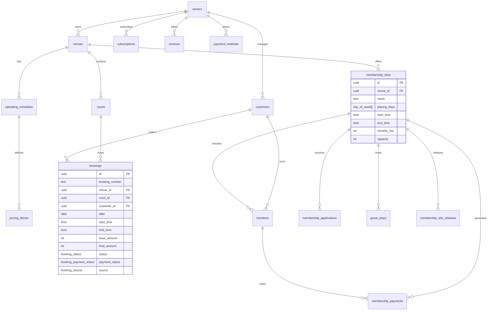
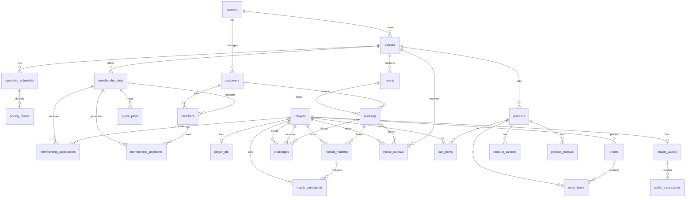

# Badminton Manager — Database Design (Supabase / PostgreSQL)

## 1. Design Principles

- Every table includes `id` (UUID, PK), `created_at`, `updated_at` audit fields
- Soft deletes via `deleted_at` timestamp (nullable)
- All foreign keys enforce referential integrity
- Row Level Security (RLS) on every table
- ENUMs for status fields to enforce valid states
- Indexes on frequently queried/filtered columns
- Multi-venue support baked into schema (every entity scoped to venue)
- Booking time constraints: start at :00 or :30, whole-hour durations

---

## 2. Enums

```sql
-- Authentication & Roles
CREATE TYPE user_role AS ENUM ('super_admin', 'owner');

-- Booking & Court
CREATE TYPE booking_status AS ENUM ('upcoming', 'ongoing', 'completed', 'cancelled');
CREATE TYPE booking_payment_status AS ENUM ('pending', 'partial', 'paid', 'refunded', 'cancelled');
CREATE TYPE slot_type AS ENUM ('available', 'booked', 'coaching', 'tournament', 'maintenance', 'blocked', 'membership');
CREATE TYPE booking_source AS ENUM ('online', 'offline', 'walk_in', 'membership');
CREATE TYPE court_type AS ENUM ('wooden', 'synthetic', 'cement', 'mat');

-- Membership
CREATE TYPE membership_pay_status AS ENUM ('paid', 'due', 'overdue');
CREATE TYPE skill_level AS ENUM ('beginner', 'intermediate', 'advanced', 'recreational');
CREATE TYPE application_status AS ENUM ('pending', 'accepted', 'rejected', 'invited_guest');
CREATE TYPE guest_play_status AS ENUM ('upcoming', 'completed', 'accepted_member', 'rejected');

-- Payments
CREATE TYPE payment_mode AS ENUM ('cash', 'upi', 'google_pay', 'phonepe', 'bank_transfer', 'cheque', 'card', 'online');

-- Subscription (mock for MVP)
CREATE TYPE subscription_plan AS ENUM ('free', 'pro', 'enterprise');
CREATE TYPE invoice_status AS ENUM ('paid', 'pending', 'failed', 'refunded');

-- Days
CREATE TYPE day_of_week AS ENUM ('mon', 'tue', 'wed', 'thu', 'fri', 'sat', 'sun');
```

> [!NOTE]
> **Changes from original design:**
> - Removed `staff_permission` enum (no staff roles in MVP)
> - Removed `player` from `user_role` (Player App is deferred)
> - Renamed `payment_status` to `booking_payment_status` to avoid ambiguity
> - Added `refunded` and `cancelled` to `booking_payment_status`
> - Added `membership` to `slot_type` for pre-blocked membership schedule blocks
> - Added `super_admin` to `user_role` for admin panel

---

## 3. Tables

### 3.1 Core Entity Tables

```sql
-- ═══════════════════════════════════════════════════════════════
-- OWNERS (extends Supabase auth.users)
-- ═══════════════════════════════════════════════════════════════
CREATE TABLE owners (
  id            UUID PRIMARY KEY REFERENCES auth.users(id) ON DELETE CASCADE,
  full_name     TEXT NOT NULL,
  phone         TEXT NOT NULL UNIQUE,
  email         TEXT,                              -- optional, for account recovery
  avatar_url    TEXT,
  business_name TEXT NOT NULL,
  role          user_role NOT NULL DEFAULT 'owner',
  created_at    TIMESTAMPTZ NOT NULL DEFAULT NOW(),
  updated_at    TIMESTAMPTZ NOT NULL DEFAULT NOW(),
  deleted_at    TIMESTAMPTZ
);

CREATE INDEX idx_owners_phone ON owners(phone);

-- ═══════════════════════════════════════════════════════════════
-- VENUES
-- ═══════════════════════════════════════════════════════════════
CREATE TABLE venues (
  id              UUID PRIMARY KEY DEFAULT gen_random_uuid(),
  owner_id        UUID NOT NULL REFERENCES owners(id) ON DELETE CASCADE,
  name            TEXT NOT NULL,
  address         TEXT,
  city            TEXT,
  state           TEXT,
  pincode         TEXT,
  latitude        DECIMAL(9,6),
  longitude       DECIMAL(9,6),
  contact_phone   TEXT,
  contact_email   TEXT,
  court_type      court_type,
  amenities       TEXT[] DEFAULT '{}',           -- Array of amenity names
  photos          TEXT[] DEFAULT '{}',           -- Array of storage URLs
  gstin           TEXT,                           -- Optional GST number
  gst_enabled     BOOLEAN NOT NULL DEFAULT FALSE, -- Toggle for GST on receipts
  is_active       BOOLEAN NOT NULL DEFAULT TRUE,
  created_at      TIMESTAMPTZ NOT NULL DEFAULT NOW(),
  updated_at      TIMESTAMPTZ NOT NULL DEFAULT NOW(),
  deleted_at      TIMESTAMPTZ
);

CREATE INDEX idx_venues_owner ON venues(owner_id);

-- ═══════════════════════════════════════════════════════════════
-- COURTS
-- ═══════════════════════════════════════════════════════════════
CREATE TABLE courts (
  id          UUID PRIMARY KEY DEFAULT gen_random_uuid(),
  venue_id    UUID NOT NULL REFERENCES venues(id) ON DELETE CASCADE,
  name        TEXT NOT NULL,                     -- e.g., "Court 1"
  court_type  court_type,                        -- Wooden, Synthetic, Cement, Mat (metadata only)
  sort_order  INTEGER NOT NULL DEFAULT 0,
  is_active   BOOLEAN NOT NULL DEFAULT TRUE,
  created_at  TIMESTAMPTZ NOT NULL DEFAULT NOW(),
  updated_at  TIMESTAMPTZ NOT NULL DEFAULT NOW(),
  deleted_at  TIMESTAMPTZ
);

CREATE INDEX idx_courts_venue ON courts(venue_id);
```

> [!NOTE]
> **Staff table removed for MVP.** Owner-only access. The 3-4 device login limit is sufficient. Staff roles may be added in a future version.

### 3.2 Schedule & Pricing

```sql
-- ═══════════════════════════════════════════════════════════════
-- OPERATING SCHEDULES (per venue per day)
-- ═══════════════════════════════════════════════════════════════
CREATE TABLE operating_schedules (
  id          UUID PRIMARY KEY DEFAULT gen_random_uuid(),
  venue_id    UUID NOT NULL REFERENCES venues(id) ON DELETE CASCADE,
  day_of_week day_of_week NOT NULL,
  is_closed   BOOLEAN NOT NULL DEFAULT FALSE,
  is_24h      BOOLEAN NOT NULL DEFAULT FALSE,
  created_at  TIMESTAMPTZ NOT NULL DEFAULT NOW(),
  updated_at  TIMESTAMPTZ NOT NULL DEFAULT NOW(),

  UNIQUE(venue_id, day_of_week)
);

-- ═══════════════════════════════════════════════════════════════
-- PRICING BLOCKS (time-based pricing within a day)
-- ═══════════════════════════════════════════════════════════════
CREATE TABLE pricing_blocks (
  id              UUID PRIMARY KEY DEFAULT gen_random_uuid(),
  schedule_id     UUID NOT NULL REFERENCES operating_schedules(id) ON DELETE CASCADE,
  start_time      TIME NOT NULL,
  end_time        TIME NOT NULL,
  price_per_hour  INTEGER NOT NULL,              -- in smallest currency unit (paise)
  court_ids       UUID[] DEFAULT '{}',           -- empty = all courts in venue
  is_active       BOOLEAN NOT NULL DEFAULT TRUE,
  sort_order      INTEGER NOT NULL DEFAULT 0,
  created_at      TIMESTAMPTZ NOT NULL DEFAULT NOW(),
  updated_at      TIMESTAMPTZ NOT NULL DEFAULT NOW(),

  CONSTRAINT valid_time_range CHECK (end_time > start_time)
);

CREATE INDEX idx_pricing_schedule ON pricing_blocks(schedule_id);
```

### 3.3 Bookings & Customers

```sql
-- ═══════════════════════════════════════════════════════════════
-- CUSTOMERS
-- ═══════════════════════════════════════════════════════════════
CREATE TABLE customers (
  id            UUID PRIMARY KEY DEFAULT gen_random_uuid(),
  owner_id      UUID NOT NULL REFERENCES owners(id) ON DELETE CASCADE,
  user_id       UUID REFERENCES auth.users(id),  -- linked if player has an account (future)
  full_name     TEXT NOT NULL,
  phone         TEXT NOT NULL,
  email         TEXT,
  notes         TEXT,
  total_visits  INTEGER NOT NULL DEFAULT 0,
  total_spent   INTEGER NOT NULL DEFAULT 0,       -- paise
  created_at    TIMESTAMPTZ NOT NULL DEFAULT NOW(),
  updated_at    TIMESTAMPTZ NOT NULL DEFAULT NOW(),
  deleted_at    TIMESTAMPTZ,

  UNIQUE(owner_id, phone)
);

CREATE INDEX idx_customers_owner ON customers(owner_id);
CREATE INDEX idx_customers_phone ON customers(phone);

-- ═══════════════════════════════════════════════════════════════
-- BOOKINGS
-- ═══════════════════════════════════════════════════════════════
CREATE TABLE bookings (
  id              UUID PRIMARY KEY DEFAULT gen_random_uuid(),
  booking_number  TEXT NOT NULL UNIQUE,           -- human-readable ID (e.g., BK001)
  venue_id        UUID NOT NULL REFERENCES venues(id),
  court_id        UUID NOT NULL REFERENCES courts(id),
  customer_id     UUID REFERENCES customers(id),  -- nullable for blocking the slots
  booked_by       UUID NOT NULL REFERENCES auth.users(id), -- owner who created
  date            DATE NOT NULL,
  start_time      TIME NOT NULL,
  end_time        TIME NOT NULL,
  duration_minutes INTEGER NOT NULL,
  base_amount     INTEGER NOT NULL,               -- auto-calculated price (paise)
  discount        INTEGER NOT NULL DEFAULT 0,     -- discount amount (paise)
  final_amount    INTEGER NOT NULL,               -- final price after discount (paise)
  advance         INTEGER NOT NULL DEFAULT 0,     -- advance paid (paise)
  pending         INTEGER NOT NULL DEFAULT 0,     -- remaining (paise)
  status          booking_status NOT NULL DEFAULT 'upcoming',
  payment_status  booking_payment_status NOT NULL DEFAULT 'pending',
  payment_mode    payment_mode,
  source          booking_source NOT NULL DEFAULT 'offline',
  slot_type       slot_type NOT NULL DEFAULT 'booked',
  is_force_booked BOOLEAN NOT NULL DEFAULT FALSE, -- owner override on blocked/maintenance slot
  notes           TEXT,
  payment_notes   TEXT,                            -- notes when payment status changes
  whatsapp_sent   BOOLEAN NOT NULL DEFAULT FALSE,
  created_at      TIMESTAMPTZ NOT NULL DEFAULT NOW(),
  updated_at      TIMESTAMPTZ NOT NULL DEFAULT NOW(),
  deleted_at      TIMESTAMPTZ,

  -- Start time must be on :00 or :30
  CONSTRAINT valid_start_time CHECK (
    EXTRACT(MINUTE FROM start_time) IN (0, 30)
  ),
  -- Duration must be in whole-hour increments (60, 120, 180, ...)
  CONSTRAINT valid_duration CHECK (
    duration_minutes > 0 AND duration_minutes % 60 = 0
  ),
  CONSTRAINT valid_booking_time CHECK (end_time > start_time)
);

CREATE INDEX idx_bookings_venue_date ON bookings(venue_id, date);
CREATE INDEX idx_bookings_court_date ON bookings(court_id, date);
CREATE INDEX idx_bookings_customer ON bookings(customer_id);
CREATE INDEX idx_bookings_status ON bookings(status);
CREATE INDEX idx_bookings_payment ON bookings(payment_status);
```

> [!NOTE]
> **Changes from original design:**
> - Added `base_amount` and `final_amount` (store both for reporting accuracy)
> - Added `payment_notes` field for notes when payment status changes
> - Added `is_force_booked` flag for owner override on blocked/maintenance slots
> - Added `valid_start_time` constraint (must be :00 or :30)
> - Added `valid_duration` constraint (must be whole-hour multiples of 60)
> - `booking_payment_status` now includes `refunded` and `cancelled`

### 3.4 Membership System

```sql
-- ═══════════════════════════════════════════════════════════════
-- MEMBERSHIP SLOTS
-- ═══════════════════════════════════════════════════════════════
CREATE TABLE membership_slots (
  id              UUID PRIMARY KEY DEFAULT gen_random_uuid(),
  venue_id        UUID NOT NULL REFERENCES venues(id) ON DELETE CASCADE,
  name            TEXT NOT NULL,
  playing_days    day_of_week[] NOT NULL,
  start_time      TIME NOT NULL,
  end_time        TIME NOT NULL,
  skill_level     skill_level NOT NULL DEFAULT 'intermediate',
  monthly_fee     INTEGER NOT NULL,               -- paise
  capacity        INTEGER NOT NULL,
  guest_play_fee  INTEGER NOT NULL DEFAULT 0,     -- paise
  allow_guest_play BOOLEAN NOT NULL DEFAULT FALSE,
  billing_day     INTEGER NOT NULL DEFAULT 1,     -- day of month
  is_published    BOOLEAN NOT NULL DEFAULT FALSE,
  is_recruiting   BOOLEAN NOT NULL DEFAULT TRUE,
  court_id        UUID REFERENCES courts(id),     -- NULL = any court at venue
  created_at      TIMESTAMPTZ NOT NULL DEFAULT NOW(),
  updated_at      TIMESTAMPTZ NOT NULL DEFAULT NOW(),
  deleted_at      TIMESTAMPTZ
);

CREATE INDEX idx_membership_slots_venue ON membership_slots(venue_id);

-- ═══════════════════════════════════════════════════════════════
-- MEMBERSHIP SLOT RELEASES (per-date slot release for walk-ins)
-- ═══════════════════════════════════════════════════════════════
CREATE TABLE membership_slot_releases (
  id              UUID PRIMARY KEY DEFAULT gen_random_uuid(),
  slot_id         UUID NOT NULL REFERENCES membership_slots(id) ON DELETE CASCADE,
  release_date    DATE NOT NULL,
  released_by     UUID NOT NULL REFERENCES auth.users(id),
  created_at      TIMESTAMPTZ NOT NULL DEFAULT NOW(),

  UNIQUE(slot_id, release_date)
);

-- ═══════════════════════════════════════════════════════════════
-- MEMBERS (join table: customer ↔ membership_slot)
-- ═══════════════════════════════════════════════════════════════
CREATE TABLE members (
  id              UUID PRIMARY KEY DEFAULT gen_random_uuid(),
  slot_id         UUID NOT NULL REFERENCES membership_slots(id) ON DELETE CASCADE,
  customer_id     UUID NOT NULL REFERENCES customers(id),
  is_active       BOOLEAN NOT NULL DEFAULT TRUE,
  join_date       DATE NOT NULL DEFAULT CURRENT_DATE,
  created_at      TIMESTAMPTZ NOT NULL DEFAULT NOW(),
  updated_at      TIMESTAMPTZ NOT NULL DEFAULT NOW(),
  deleted_at      TIMESTAMPTZ,

  UNIQUE(slot_id, customer_id)
);

CREATE INDEX idx_members_slot ON members(slot_id);
CREATE INDEX idx_members_customer ON members(customer_id);

-- ═══════════════════════════════════════════════════════════════
-- MEMBERSHIP APPLICATIONS (future — from Player App)
-- ═══════════════════════════════════════════════════════════════
CREATE TABLE membership_applications (
  id              UUID PRIMARY KEY DEFAULT gen_random_uuid(),
  slot_id         UUID NOT NULL REFERENCES membership_slots(id) ON DELETE CASCADE,
  applicant_name  TEXT NOT NULL,
  phone           TEXT NOT NULL,
  photo_url       TEXT,
  skill_level     skill_level,
  experience      TEXT,
  preferred_days  day_of_week[],
  status          application_status NOT NULL DEFAULT 'pending',
  reviewed_at     TIMESTAMPTZ,
  reviewed_by     UUID REFERENCES auth.users(id),
  created_at      TIMESTAMPTZ NOT NULL DEFAULT NOW(),
  updated_at      TIMESTAMPTZ NOT NULL DEFAULT NOW()
);

CREATE INDEX idx_applications_slot ON membership_applications(slot_id);
CREATE INDEX idx_applications_status ON membership_applications(status);

-- ═══════════════════════════════════════════════════════════════
-- GUEST PLAYS
-- ═══════════════════════════════════════════════════════════════
CREATE TABLE guest_plays (
  id              UUID PRIMARY KEY DEFAULT gen_random_uuid(),
  slot_id         UUID NOT NULL REFERENCES membership_slots(id) ON DELETE CASCADE,
  application_id  UUID REFERENCES membership_applications(id),
  player_name     TEXT NOT NULL,
  phone           TEXT NOT NULL,
  scheduled_date  DATE NOT NULL,
  status          guest_play_status NOT NULL DEFAULT 'upcoming',
  notes           TEXT,
  created_at      TIMESTAMPTZ NOT NULL DEFAULT NOW(),
  updated_at      TIMESTAMPTZ NOT NULL DEFAULT NOW()
);

CREATE INDEX idx_guest_plays_slot ON guest_plays(slot_id);
```

> [!NOTE]
> **Added `membership_slot_releases` table** — tracks when an owner releases a membership slot for a specific date, making it available for walk-in bookings.

### 3.5 Membership Payments

```sql
-- ═══════════════════════════════════════════════════════════════
-- MEMBERSHIP PAYMENTS
-- ═══════════════════════════════════════════════════════════════
CREATE TABLE membership_payments (
  id              UUID PRIMARY KEY DEFAULT gen_random_uuid(),
  member_id       UUID NOT NULL REFERENCES members(id) ON DELETE CASCADE,
  slot_id         UUID NOT NULL REFERENCES membership_slots(id),
  amount          INTEGER NOT NULL,               -- paise
  billing_period  DATE NOT NULL,                  -- first day of the billing month
  due_date        DATE NOT NULL,
  status          membership_pay_status NOT NULL DEFAULT 'due',
  payment_mode    payment_mode,
  paid_on         DATE,
  receipt_url     TEXT,
  notes           TEXT,
  recorded_by     UUID REFERENCES auth.users(id),
  created_at      TIMESTAMPTZ NOT NULL DEFAULT NOW(),
  updated_at      TIMESTAMPTZ NOT NULL DEFAULT NOW(),
  is_voided       BOOLEAN NOT NULL DEFAULT FALSE, -- Incase member is removed mid-month and owner ignores due

  UNIQUE(member_id, billing_period)
);

CREATE INDEX idx_membership_payments_member ON membership_payments(member_id);
CREATE INDEX idx_membership_payments_slot ON membership_payments(slot_id);
CREATE INDEX idx_membership_payments_status ON membership_payments(status);
CREATE INDEX idx_membership_payments_due ON membership_payments(due_date);
```

### 3.6 Subscription & Billing (Mock for MVP)

```sql
-- ═══════════════════════════════════════════════════════════════
-- SUBSCRIPTIONS (SaaS billing for venue owners — static mock for MVP)
-- ═══════════════════════════════════════════════════════════════
CREATE TABLE subscriptions (
  id              UUID PRIMARY KEY DEFAULT gen_random_uuid(),
  owner_id        UUID NOT NULL REFERENCES owners(id) ON DELETE CASCADE,
  plan            subscription_plan NOT NULL DEFAULT 'free',
  started_at      TIMESTAMPTZ NOT NULL DEFAULT NOW(),
  expires_at      TIMESTAMPTZ,
  is_active       BOOLEAN NOT NULL DEFAULT TRUE,
  created_at      TIMESTAMPTZ NOT NULL DEFAULT NOW(),
  updated_at      TIMESTAMPTZ NOT NULL DEFAULT NOW()
);

CREATE TABLE invoices (
  id              UUID PRIMARY KEY DEFAULT gen_random_uuid(),
  owner_id        UUID NOT NULL REFERENCES owners(id) ON DELETE CASCADE,
  subscription_id UUID REFERENCES subscriptions(id),
  invoice_number  TEXT NOT NULL UNIQUE,
  amount          INTEGER NOT NULL,               -- paise
  status          invoice_status NOT NULL DEFAULT 'pending',
  paid_at         TIMESTAMPTZ,
  pdf_url         TEXT,
  created_at      TIMESTAMPTZ NOT NULL DEFAULT NOW(),
  updated_at      TIMESTAMPTZ NOT NULL DEFAULT NOW()
);

CREATE TABLE payment_methods (
  id              UUID PRIMARY KEY DEFAULT gen_random_uuid(),
  owner_id        UUID NOT NULL REFERENCES owners(id) ON DELETE CASCADE,
  type            TEXT NOT NULL,                   -- 'card', 'upi', 'bank_account'
  last_four       TEXT,
  brand           TEXT,
  is_default      BOOLEAN NOT NULL DEFAULT FALSE,
  created_at      TIMESTAMPTZ NOT NULL DEFAULT NOW(),
  updated_at      TIMESTAMPTZ NOT NULL DEFAULT NOW(),
  deleted_at      TIMESTAMPTZ
);
```

---

## 4. Row Level Security (RLS) Strategy

```sql
-- Enable RLS on all tables
ALTER TABLE owners ENABLE ROW LEVEL SECURITY;
ALTER TABLE venues ENABLE ROW LEVEL SECURITY;
ALTER TABLE courts ENABLE ROW LEVEL SECURITY;
ALTER TABLE bookings ENABLE ROW LEVEL SECURITY;
ALTER TABLE customers ENABLE ROW LEVEL SECURITY;
ALTER TABLE membership_slots ENABLE ROW LEVEL SECURITY;
ALTER TABLE members ENABLE ROW LEVEL SECURITY;
ALTER TABLE membership_applications ENABLE ROW LEVEL SECURITY;
ALTER TABLE guest_plays ENABLE ROW LEVEL SECURITY;
ALTER TABLE membership_payments ENABLE ROW LEVEL SECURITY;
-- ... (all tables)

-- SUPER-ADMIN: can see ALL data
CREATE POLICY "Super-admin full access" ON venues
  FOR ALL USING (
    EXISTS (SELECT 1 FROM owners WHERE id = auth.uid() AND role = 'super_admin')
  );

-- OWNERS: can only see their own record
CREATE POLICY "Owners see own data" ON owners
  FOR ALL USING (auth.uid() = id);

-- VENUES: owner sees their venues
CREATE POLICY "Owner sees own venues" ON venues
  FOR ALL USING (owner_id = auth.uid());

-- COURTS: owner sees courts in their venues
CREATE POLICY "Owner sees own courts" ON courts
  FOR ALL USING (
    venue_id IN (SELECT id FROM venues WHERE owner_id = auth.uid())
  );

-- BOOKINGS: owner sees bookings at their venues
CREATE POLICY "Owner sees own bookings" ON bookings
  FOR ALL USING (
    venue_id IN (SELECT id FROM venues WHERE owner_id = auth.uid())
  );

-- Pattern: All downstream tables follow the same venue-ownership chain
-- Super-admin policies added to every table for admin panel access
```

---

## 5. Storage Requirements (Supabase Storage)

| Bucket | Content | Access |
|--------|---------|--------|
| `venue-photos` | Venue/court images | Public read, authenticated write |
| `member-photos` | Application profile photos | Authenticated read/write |
| `receipts` | Payment receipt PDFs | Authenticated read, server write |
| `invoices` | Subscription invoice PDFs | Authenticated read, server write |

---

## 6. Entity Relationship Diagram



---

## 7. Report Views (for Revenue Breakdown)

```sql
-- Revenue breakdown: Booking Revenue vs Membership Revenue
CREATE VIEW revenue_summary AS
SELECT
  v.id AS venue_id,
  v.name AS venue_name,
  COALESCE(SUM(b.final_amount) FILTER (WHERE b.payment_status = 'paid'), 0) AS booking_revenue,
  COALESCE(SUM(mp.amount) FILTER (WHERE mp.status = 'paid'), 0) AS membership_revenue,
  COALESCE(SUM(b.final_amount) FILTER (WHERE b.payment_status = 'paid'), 0) +
  COALESCE(SUM(mp.amount) FILTER (WHERE mp.status = 'paid'), 0) AS total_revenue
FROM venues v
LEFT JOIN bookings b ON b.venue_id = v.id AND b.deleted_at IS NULL
LEFT JOIN membership_slots ms ON ms.venue_id = v.id AND ms.deleted_at IS NULL
LEFT JOIN membership_payments mp ON mp.slot_id = ms.id
GROUP BY v.id, v.name;
```

---

## Phase 2: ShuttleHub (Player App) — Schema Additions

> [!NOTE]
> The Player App shares the same Supabase database. All additions below are designed to coexist with the existing Owner/Admin schema. The `user_role` enum is **NOT modified** — players are identified by having a row in the `players` table, not by an enum value. A user can be both an owner AND a player simultaneously.

### P2.1 New Enums

```sql
-- Player Identity
CREATE TYPE id_proof_type AS ENUM ('aadhaar', 'driving_license', 'passport', 'voter_id');
CREATE TYPE verification_status AS ENUM ('pending', 'verified', 'rejected');

-- Social Features
CREATE TYPE challenge_status AS ENUM ('pending', 'accepted', 'declined', 'expired', 'completed');
CREATE TYPE hosted_match_status AS ENUM ('open', 'full', 'live', 'completed', 'cancelled');
CREATE TYPE match_format AS ENUM ('singles', 'doubles', 'mixed');

-- Shop / E-Commerce
CREATE TYPE order_status AS ENUM ('placed', 'processing', 'ready_for_pickup', 'completed', 'cancelled', 'refunded');
CREATE TYPE product_listing_source AS ENUM ('admin', 'owner');

-- Wallet
CREATE TYPE wallet_transaction_type AS ENUM ('admin_credit', 'booking_payment', 'shop_payment', 'tournament_payment', 'refund');

-- Notifications
CREATE TYPE notification_type AS ENUM (
  'booking_confirmation', 'booking_reminder', 'booking_cancelled',
  'challenge_received', 'challenge_accepted', 'challenge_declined',
  'guest_play_invitation', 'membership_payment_reminder',
  'match_invitation', 'order_update', 'wallet_credit',
  'system'
);
```

### P2.2 Modified Tables

```sql
-- ═══════════════════════════════════════════════════════════════
-- VENUES — Player-facing config columns
-- ═══════════════════════════════════════════════════════════════
ALTER TABLE venues
  ADD COLUMN min_slot_duration INTEGER NOT NULL DEFAULT 60,     -- minutes (30, 60, etc.)
  ADD COLUMN cancellation_hours INTEGER NOT NULL DEFAULT 2,     -- free cancel up to X hrs before
  ADD COLUMN platform_fee INTEGER NOT NULL DEFAULT 0,           -- per-booking fee (paise)
  ADD COLUMN average_rating NUMERIC DEFAULT 0,
  ADD COLUMN total_reviews INTEGER NOT NULL DEFAULT 0;

-- ═══════════════════════════════════════════════════════════════
-- MEMBERSHIP APPLICATIONS — Link to player account
-- ═══════════════════════════════════════════════════════════════
ALTER TABLE membership_applications
  ADD COLUMN player_id UUID REFERENCES players(id);
```

### P2.3 New Tables — Player Identity

```sql
-- ═══════════════════════════════════════════════════════════════
-- PLAYERS (extends Supabase auth.users — SEPARATE from owners)
-- A user can have rows in BOTH owners AND players tables
-- ═══════════════════════════════════════════════════════════════
CREATE TABLE players (
  id              UUID PRIMARY KEY DEFAULT gen_random_uuid(),
  user_id         UUID NOT NULL UNIQUE REFERENCES auth.users(id),
  full_name       TEXT NOT NULL,
  phone           TEXT NOT NULL,
  email           TEXT,
  date_of_birth   DATE,
  gender          TEXT,                              -- 'male', 'female', 'other'
  city            TEXT,
  state           TEXT,
  latitude        NUMERIC,
  longitude       NUMERIC,
  profile_photo_url TEXT,
  skill_level     skill_level DEFAULT 'beginner',
  bio             TEXT,
  fcm_token       TEXT,                              -- FCM push notification token
  is_active       BOOLEAN NOT NULL DEFAULT TRUE,
  created_at      TIMESTAMPTZ NOT NULL DEFAULT now(),
  updated_at      TIMESTAMPTZ NOT NULL DEFAULT now(),

  CONSTRAINT players_phone_unique UNIQUE (phone)
);

CREATE INDEX idx_players_user ON players(user_id);
CREATE INDEX idx_players_city ON players(city);
CREATE INDEX idx_players_phone ON players(phone);

-- ═══════════════════════════════════════════════════════════════
-- PLAYER IDS (verification records — required for tournaments & rankings)
-- ═══════════════════════════════════════════════════════════════
CREATE TABLE player_ids (
  id                  UUID PRIMARY KEY DEFAULT gen_random_uuid(),
  player_id           UUID NOT NULL UNIQUE REFERENCES players(id),
  player_id_number    TEXT NOT NULL UNIQUE,           -- e.g., 'SH-45821'
  id_proof_type       id_proof_type NOT NULL,
  id_proof_last4      TEXT NOT NULL,                  -- last 4 digits only
  id_proof_document_url TEXT,                         -- uploaded proof (Supabase Storage)
  verification_status verification_status NOT NULL DEFAULT 'pending',
  verified_at         TIMESTAMPTZ,
  verified_by         UUID REFERENCES auth.users(id), -- admin who reviewed
  created_at          TIMESTAMPTZ NOT NULL DEFAULT now(),
  updated_at          TIMESTAMPTZ NOT NULL DEFAULT now()
);
```

### P2.4 New Tables — Social Features

```sql
-- ═══════════════════════════════════════════════════════════════
-- CHALLENGES (player-to-player, booking-gated)
-- ═══════════════════════════════════════════════════════════════
CREATE TABLE challenges (
  id              UUID PRIMARY KEY DEFAULT gen_random_uuid(),
  challenger_id   UUID NOT NULL REFERENCES players(id),
  challenged_id   UUID NOT NULL REFERENCES players(id),
  booking_id      UUID NOT NULL REFERENCES bookings(id),
  match_format    match_format NOT NULL DEFAULT 'singles',
  message         TEXT,
  status          challenge_status NOT NULL DEFAULT 'pending',
  responded_at    TIMESTAMPTZ,
  created_at      TIMESTAMPTZ NOT NULL DEFAULT now(),
  updated_at      TIMESTAMPTZ NOT NULL DEFAULT now()
);

CREATE INDEX idx_challenges_challenger ON challenges(challenger_id);
CREATE INDEX idx_challenges_challenged ON challenges(challenged_id);
CREATE INDEX idx_challenges_status ON challenges(status);

-- ═══════════════════════════════════════════════════════════════
-- HOSTED MATCHES (player hosts a match linked to their booking)
-- ═══════════════════════════════════════════════════════════════
CREATE TABLE hosted_matches (
  id              UUID PRIMARY KEY DEFAULT gen_random_uuid(),
  host_id         UUID NOT NULL REFERENCES players(id),
  booking_id      UUID NOT NULL REFERENCES bookings(id),
  match_format    match_format NOT NULL DEFAULT 'singles',
  skill_level     skill_level NOT NULL DEFAULT 'intermediate',
  visibility      TEXT NOT NULL DEFAULT 'public',    -- 'public' or 'private'
  max_players     INTEGER NOT NULL DEFAULT 4,
  status          hosted_match_status NOT NULL DEFAULT 'open',
  created_at      TIMESTAMPTZ NOT NULL DEFAULT now(),
  updated_at      TIMESTAMPTZ NOT NULL DEFAULT now()
);

CREATE INDEX idx_hosted_matches_host ON hosted_matches(host_id);
CREATE INDEX idx_hosted_matches_status ON hosted_matches(status);

-- ═══════════════════════════════════════════════════════════════
-- MATCH PARTICIPANTS (players who joined a hosted match)
-- ═══════════════════════════════════════════════════════════════
CREATE TABLE match_participants (
  id              UUID PRIMARY KEY DEFAULT gen_random_uuid(),
  match_id        UUID NOT NULL REFERENCES hosted_matches(id),
  player_id       UUID NOT NULL REFERENCES players(id),
  status          TEXT NOT NULL DEFAULT 'joined',    -- 'joined', 'left', 'removed'
  joined_at       TIMESTAMPTZ NOT NULL DEFAULT now(),

  UNIQUE(match_id, player_id)
);
```

### P2.5 New Tables — Shop / E-Commerce

```sql
-- ═══════════════════════════════════════════════════════════════
-- PRODUCT CATEGORIES
-- ═══════════════════════════════════════════════════════════════
CREATE TABLE product_categories (
  id          UUID PRIMARY KEY DEFAULT gen_random_uuid(),
  name        TEXT NOT NULL,
  sort_order  INTEGER NOT NULL DEFAULT 0,
  created_at  TIMESTAMPTZ NOT NULL DEFAULT now()
);

-- ═══════════════════════════════════════════════════════════════
-- PRODUCTS (listed by admin or venue owners)
-- ═══════════════════════════════════════════════════════════════
CREATE TABLE products (
  id                UUID PRIMARY KEY DEFAULT gen_random_uuid(),
  name              TEXT NOT NULL,
  description       TEXT,
  category_id       UUID REFERENCES product_categories(id),
  price             INTEGER NOT NULL,                -- paise
  compare_at_price  INTEGER,                         -- original price for discount display
  images            TEXT[] DEFAULT '{}',
  listing_source    product_listing_source NOT NULL DEFAULT 'admin',
  venue_id          UUID REFERENCES venues(id),      -- set if owner-listed (pickup only)
  owner_id          UUID REFERENCES owners(id),      -- set if owner-listed
  is_pickup_only    BOOLEAN NOT NULL DEFAULT FALSE,
  stock_quantity    INTEGER NOT NULL DEFAULT 0,
  is_active         BOOLEAN NOT NULL DEFAULT TRUE,
  created_at        TIMESTAMPTZ NOT NULL DEFAULT now(),
  updated_at        TIMESTAMPTZ NOT NULL DEFAULT now()
);

CREATE INDEX idx_products_category ON products(category_id);
CREATE INDEX idx_products_active ON products(is_active);

-- ═══════════════════════════════════════════════════════════════
-- PRODUCT VARIANTS (color, size, etc.)
-- ═══════════════════════════════════════════════════════════════
CREATE TABLE product_variants (
  id                UUID PRIMARY KEY DEFAULT gen_random_uuid(),
  product_id        UUID NOT NULL REFERENCES products(id) ON DELETE CASCADE,
  name              TEXT NOT NULL,                   -- e.g., 'Color', 'Size'
  value             TEXT NOT NULL,                   -- e.g., 'Red', 'XL'
  price_adjustment  INTEGER NOT NULL DEFAULT 0,      -- paise (+/-)
  stock_quantity    INTEGER NOT NULL DEFAULT 0,
  is_active         BOOLEAN NOT NULL DEFAULT TRUE
);

-- ═══════════════════════════════════════════════════════════════
-- PRODUCT REVIEWS
-- ═══════════════════════════════════════════════════════════════
CREATE TABLE product_reviews (
  id              UUID PRIMARY KEY DEFAULT gen_random_uuid(),
  product_id      UUID NOT NULL REFERENCES products(id),
  player_id       UUID NOT NULL REFERENCES players(id),
  order_id        UUID NOT NULL,                     -- FK added after orders table
  rating          INTEGER NOT NULL CHECK (rating >= 1 AND rating <= 5),
  review_text     TEXT,
  created_at      TIMESTAMPTZ NOT NULL DEFAULT now()
);

-- ═══════════════════════════════════════════════════════════════
-- CART ITEMS
-- ═══════════════════════════════════════════════════════════════
CREATE TABLE cart_items (
  id              UUID PRIMARY KEY DEFAULT gen_random_uuid(),
  player_id       UUID NOT NULL REFERENCES players(id),
  product_id      UUID NOT NULL REFERENCES products(id),
  variant_id      UUID REFERENCES product_variants(id),
  quantity        INTEGER NOT NULL DEFAULT 1 CHECK (quantity > 0),
  created_at      TIMESTAMPTZ NOT NULL DEFAULT now()
);

CREATE INDEX idx_cart_player ON cart_items(player_id);

-- ═══════════════════════════════════════════════════════════════
-- ORDERS
-- ═══════════════════════════════════════════════════════════════
CREATE TABLE orders (
  id              UUID PRIMARY KEY DEFAULT gen_random_uuid(),
  order_number    TEXT NOT NULL UNIQUE,
  player_id       UUID NOT NULL REFERENCES players(id),
  subtotal        INTEGER NOT NULL,                  -- paise
  platform_fee    INTEGER NOT NULL DEFAULT 0,        -- paise
  total_amount    INTEGER NOT NULL,                  -- paise
  payment_method  TEXT,                              -- 'wallet', 'pay_at_pickup'
  status          order_status NOT NULL DEFAULT 'placed',
  venue_id        UUID REFERENCES venues(id),        -- for pickup orders
  notes           TEXT,
  created_at      TIMESTAMPTZ NOT NULL DEFAULT now(),
  updated_at      TIMESTAMPTZ NOT NULL DEFAULT now()
);

CREATE INDEX idx_orders_player ON orders(player_id);
CREATE INDEX idx_orders_status ON orders(status);

-- ═══════════════════════════════════════════════════════════════
-- ORDER ITEMS
-- ═══════════════════════════════════════════════════════════════
CREATE TABLE order_items (
  id              UUID PRIMARY KEY DEFAULT gen_random_uuid(),
  order_id        UUID NOT NULL REFERENCES orders(id) ON DELETE CASCADE,
  product_id      UUID NOT NULL REFERENCES products(id),
  variant_id      UUID REFERENCES product_variants(id),
  quantity        INTEGER NOT NULL,
  unit_price      INTEGER NOT NULL,                  -- paise
  total_price     INTEGER NOT NULL                   -- paise
);
```

### P2.6 New Tables — Notifications, Wallet, Coaches, Reviews

```sql
-- ═══════════════════════════════════════════════════════════════
-- NOTIFICATIONS (shared across owner + player apps)
-- ═══════════════════════════════════════════════════════════════
CREATE TABLE notifications (
  id              UUID PRIMARY KEY DEFAULT gen_random_uuid(),
  user_id         UUID NOT NULL REFERENCES auth.users(id),
  type            notification_type NOT NULL,
  title           TEXT NOT NULL,
  body            TEXT NOT NULL,
  data            JSONB DEFAULT '{}',                -- payload (booking_id, challenge_id, etc.)
  is_read         BOOLEAN NOT NULL DEFAULT FALSE,
  is_actioned     BOOLEAN NOT NULL DEFAULT FALSE,    -- for actionable notifications
  created_at      TIMESTAMPTZ NOT NULL DEFAULT now()
);

CREATE INDEX idx_notifications_user ON notifications(user_id);
CREATE INDEX idx_notifications_read ON notifications(user_id, is_read);

-- ═══════════════════════════════════════════════════════════════
-- PLAYER WALLETS (balance managed by admin only)
-- ═══════════════════════════════════════════════════════════════
CREATE TABLE player_wallets (
  id              UUID PRIMARY KEY DEFAULT gen_random_uuid(),
  player_id       UUID NOT NULL UNIQUE REFERENCES players(id),
  balance         INTEGER NOT NULL DEFAULT 0,        -- paise
  created_at      TIMESTAMPTZ NOT NULL DEFAULT now(),
  updated_at      TIMESTAMPTZ NOT NULL DEFAULT now()
);

-- ═══════════════════════════════════════════════════════════════
-- WALLET TRANSACTIONS
-- ═══════════════════════════════════════════════════════════════
CREATE TABLE wallet_transactions (
  id              UUID PRIMARY KEY DEFAULT gen_random_uuid(),
  wallet_id       UUID NOT NULL REFERENCES player_wallets(id),
  amount          INTEGER NOT NULL,                  -- positive = credit, negative = debit
  type            wallet_transaction_type NOT NULL,
  reference_id    UUID,                              -- booking_id, order_id, etc.
  description     TEXT NOT NULL,
  created_by      UUID NOT NULL REFERENCES auth.users(id),
  created_at      TIMESTAMPTZ NOT NULL DEFAULT now()
);

CREATE INDEX idx_wallet_txn_wallet ON wallet_transactions(wallet_id);

-- ═══════════════════════════════════════════════════════════════
-- COACHES (admin-managed, view-only in Player App)
-- ═══════════════════════════════════════════════════════════════
CREATE TABLE coaches (
  id                UUID PRIMARY KEY DEFAULT gen_random_uuid(),
  full_name         TEXT NOT NULL,
  phone             TEXT,
  email             TEXT,
  photo_url         TEXT,
  bio               TEXT,
  specializations   TEXT[] DEFAULT '{}',              -- e.g., ['singles', 'footwork', 'junior']
  experience_years  INTEGER,
  venue_ids         UUID[] DEFAULT '{}',              -- venues where they coach
  city              TEXT,
  is_active         BOOLEAN NOT NULL DEFAULT TRUE,
  created_at        TIMESTAMPTZ NOT NULL DEFAULT now(),
  updated_at        TIMESTAMPTZ NOT NULL DEFAULT now()
);

-- ═══════════════════════════════════════════════════════════════
-- VENUE REVIEWS (one per booking, post-completion)
-- ═══════════════════════════════════════════════════════════════
CREATE TABLE venue_reviews (
  id              UUID PRIMARY KEY DEFAULT gen_random_uuid(),
  venue_id        UUID NOT NULL REFERENCES venues(id),
  player_id       UUID NOT NULL REFERENCES players(id),
  booking_id      UUID NOT NULL REFERENCES bookings(id),
  rating          INTEGER NOT NULL CHECK (rating >= 1 AND rating <= 5),
  review_text     TEXT,
  is_visible      BOOLEAN NOT NULL DEFAULT TRUE,
  created_at      TIMESTAMPTZ NOT NULL DEFAULT now(),
  updated_at      TIMESTAMPTZ NOT NULL DEFAULT now(),

  UNIQUE(booking_id)  -- one review per booking
);

CREATE INDEX idx_venue_reviews_venue ON venue_reviews(venue_id);
```

### P2.7 Player RLS Strategy

```sql
-- ═══════════════════════════════════════════════════════════════
-- PLAYER RLS POLICIES
-- ═══════════════════════════════════════════════════════════════

-- Helper: Check if user is a player
CREATE FUNCTION is_player() RETURNS BOOLEAN AS $$
  SELECT EXISTS (SELECT 1 FROM players WHERE user_id = auth.uid());
$$ LANGUAGE sql SECURITY DEFINER;

-- PLAYERS: own profile CRUD, public read of others (limited fields via views)
CREATE POLICY "Players see own profile" ON players
  FOR ALL USING (user_id = auth.uid());
CREATE POLICY "Players see other players (public)" ON players
  FOR SELECT USING (is_active = TRUE);

-- VENUES: all players can read active venues
CREATE POLICY "Players read active venues" ON venues
  FOR SELECT USING (is_active = TRUE AND deleted_at IS NULL);

-- COURTS: players can read active courts
CREATE POLICY "Players read active courts" ON courts
  FOR SELECT USING (is_active = TRUE AND deleted_at IS NULL);

-- BOOKINGS: players can create (source=online) and read their own
CREATE POLICY "Players manage own bookings" ON bookings
  FOR ALL USING (booked_by = auth.uid());

-- CHALLENGES: players manage their own (sent or received)
CREATE POLICY "Players manage own challenges" ON challenges
  FOR ALL USING (
    challenger_id IN (SELECT id FROM players WHERE user_id = auth.uid())
    OR challenged_id IN (SELECT id FROM players WHERE user_id = auth.uid())
  );

-- HOSTED MATCHES: public read for open matches, host manages own
CREATE POLICY "Players read open matches" ON hosted_matches
  FOR SELECT USING (status = 'open' AND visibility = 'public');
CREATE POLICY "Host manages own matches" ON hosted_matches
  FOR ALL USING (host_id IN (SELECT id FROM players WHERE user_id = auth.uid()));

-- NOTIFICATIONS: users see only their own
CREATE POLICY "Users see own notifications" ON notifications
  FOR ALL USING (user_id = auth.uid());

-- WALLET: players see own wallet
CREATE POLICY "Players see own wallet" ON player_wallets
  FOR SELECT USING (player_id IN (SELECT id FROM players WHERE user_id = auth.uid()));
CREATE POLICY "Admin manages wallets" ON player_wallets
  FOR ALL USING (is_super_admin());

-- PRODUCTS: all authenticated users can read active products
CREATE POLICY "Authenticated read products" ON products
  FOR SELECT USING (is_active = TRUE);

-- CART: players manage own cart
CREATE POLICY "Players manage own cart" ON cart_items
  FOR ALL USING (player_id IN (SELECT id FROM players WHERE user_id = auth.uid()));

-- ORDERS: players manage own orders
CREATE POLICY "Players manage own orders" ON orders
  FOR ALL USING (player_id IN (SELECT id FROM players WHERE user_id = auth.uid()));

-- REVIEWS: players write own, all read
CREATE POLICY "Players write own reviews" ON venue_reviews
  FOR INSERT WITH CHECK (player_id IN (SELECT id FROM players WHERE user_id = auth.uid()));
CREATE POLICY "All read reviews" ON venue_reviews
  FOR SELECT USING (is_visible = TRUE);

-- MEMBERSHIP SLOTS: players can read published slots
CREATE POLICY "Players read published slots" ON membership_slots
  FOR SELECT USING (is_published = TRUE AND deleted_at IS NULL);

-- MEMBERSHIP APPLICATIONS: players can create and read their own
CREATE POLICY "Players manage own applications" ON membership_applications
  FOR ALL USING (player_id IN (SELECT id FROM players WHERE user_id = auth.uid()));

-- Super-admin policies added to ALL new tables (same pattern as Phase 1)
```

### P2.8 New Storage Buckets

| Bucket | Content | Access |
|--------|---------|--------|
| `player-photos` | Player profile photos | Public read, authenticated write |
| `player-id-proofs` | ID verification documents | Private (admin-only read, player write) |
| `product-images` | Shop product photos | Public read, admin/owner write |

### P2.9 Updated Entity Relationship Diagram


