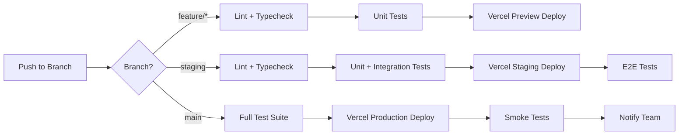

# Badminton Manager — Mobile Strategy & Deployment

## Part A: React Native (Expo) Mobile Strategy

### 1. Shared vs Platform-Specific

| Layer | Shared (Web + Mobile) | Platform-Specific |
|-------|----------------------|-------------------|
| **Types** | `types/database.ts`, `types/api.ts` | N/A |
| **Services** | All Supabase service modules | N/A |
| **Validation** | Zod schemas | N/A |
| **Business Logic** | Hooks (useBookings, useMembers, etc.) | N/A |
| **State** | Zustand stores, React Query config | Storage adapter (AsyncStorage vs localStorage) |
| **Navigation** | N/A | React Navigation (mobile) vs React Router (web) |
| **UI Components** | Component API (props/types) | Implementation differs (div→View, span→Text) |
| **Auth** | Supabase auth logic | Token storage (SecureStore vs localStorage) |
| **Notifications** | N/A | expo-notifications (mobile only) |
| **Camera** | N/A | expo-camera (member photos, court photos) |
| **File Upload** | Upload logic | expo-image-picker (mobile), input[type=file] (web) |
| **Deep Linking** | N/A | expo-linking |
| **Maps** | N/A | expo-maps or react-native-maps |

### 2. Recommended Monorepo Structure

```
venue-os/
├── packages/
│   ├── shared/                    # Shared business logic
│   │   ├── services/              # Supabase service layer
│   │   ├── hooks/                 # React Query hooks
│   │   ├── stores/                # Zustand stores
│   │   ├── types/                 # TypeScript types
│   │   ├── validators/            # Zod schemas
│   │   └── utils/                 # Formatters, constants
│   │
│   ├── web/                       # React web app
│   │   ├── src/
│   │   ├── vite.config.ts
│   │   └── package.json
│   │
│   └── mobile/                    # React Native (Expo) app
│       ├── app/                   # Expo Router file-based routing
│       ├── components/            # Native UI components
│       ├── app.json
│       └── package.json
│
├── supabase/                      # Supabase project
│   ├── migrations/
│   ├── functions/
│   └── config.toml
│
├── turbo.json                     # Turborepo config
└── package.json                   # Workspace root
```

### 3. Mobile Navigation (React Navigation / Expo Router)

```
(tabs)/
├── schedule/                      # Court timeline
├── bookings/
│   ├── index                      # Bookings list
│   ├── [id]                       # Booking detail
│   └── new                        # New booking wizard
├── members/                       # 4-tab members view
├── payments/
│   ├── index                      # Slot payment cards
│   └── [slotId]                   # Slot payments
└── profile/
    ├── index                      # Settings menu
    ├── court-info
    ├── schedule-pricing
    ├── reports
    ├── grow-business
    ├── subscription
    └── help
```

### 4. Mobile-Specific Features

| Feature | Technology | Priority |
|---------|-----------|----------|
| Push notifications | expo-notifications + Supabase webhooks | MVP |
| Camera (court/member photos) | expo-camera + expo-image-picker | MVP |
| File upload | expo-file-system + Supabase Storage | MVP |
| Deep linking | expo-linking + app.json scheme | Phase 2 |
| Offline support | WatermelonDB or MMKV caching | Phase 3 |
| Biometric auth | expo-local-authentication | Phase 2 |
| Share booking | expo-sharing | Phase 2 |
| Haptic feedback | expo-haptics | Nice-to-have |

### 5. Offline Strategy (Phase 3)

| Data | Offline Behavior |
|------|-----------------|
| Schedule (today) | Cache locally, show stale indicator |
| New bookings | Queue offline, sync when connected |
| Payment recording | Queue offline, sync when connected |
| Reports | Not available offline |
| Member list | Cache locally, read-only |

---

## Part B: Deployment Strategy

### 1. Environment Architecture

| Environment | Frontend | Backend | Purpose |
|-------------|----------|---------|---------|
| Development | localhost:5173 | Supabase Local (CLI) | Active development |
| Staging | Vercel Preview | Supabase Staging project | QA & testing |
| Production | Vercel Production | Supabase Production project | Live users |

### 2. Frontend Deployment (Vercel)

```yaml
# vercel.json
{
  "buildCommand": "cd packages/web && npm run build",
  "outputDirectory": "packages/web/dist",
  "framework": "vite",
  "rewrites": [{ "source": "/(.*)", "destination": "/index.html" }]
}
```

**Branch strategy:**
- `main` → Production deploy (auto)
- `staging` → Staging preview (auto)
- Feature branches → Preview deploys (PR-based)

### 3. Mobile Deployment (Expo EAS)

```json
// eas.json
{
  "build": {
    "development": { "distribution": "internal", "channel": "development" },
    "preview": { "distribution": "internal", "channel": "preview" },
    "production": { "channel": "production" }
  },
  "submit": {
    "production": {
      "android": { "serviceAccountKeyPath": "./google-services.json" },
      "ios": { "appleId": "...", "ascAppId": "..." }
    }
  }
}
```

### 4. Environment Variables

| Variable | Dev | Staging | Production |
|----------|-----|---------|------------|
| `VITE_SUPABASE_URL` | localhost:54321 | staging.supabase.co | prod.supabase.co |
| `VITE_SUPABASE_ANON_KEY` | local key | staging key | prod key |
| `VITE_APP_ENV` | development | staging | production |
| `VITE_SENTRY_DSN` | — | staging DSN | prod DSN |

### 5. CI/CD Pipeline



### 6. Monitoring & Analytics

| Concern | Tool | Purpose |
|---------|------|---------|
| Error tracking | Sentry | Crash reports, error boundaries |
| Analytics | PostHog or Mixpanel | User behavior, feature usage |
| Performance | Vercel Analytics | Web Vitals, page load times |
| Uptime | BetterUptime | API/site availability |
| Logs | Supabase Dashboard | Database/Edge Function logs |

### 7. Release Strategy

| Phase | Web | Mobile |
|-------|-----|--------|
| Dev | PR preview deploys | Expo Dev Client |
| Staging | Branch deploy | EAS internal distribution |
| Production | Merge to main → auto-deploy | EAS Submit to stores |
| Hotfix | Cherry-pick to main | OTA update via EAS Update |

### 8. Versioning

- Semantic versioning: `MAJOR.MINOR.PATCH`
- Web: version in `package.json`
- Mobile: `app.json` version + build number
- Database: Sequential migration files (`001_initial.sql`, `002_add_memberships.sql`)
