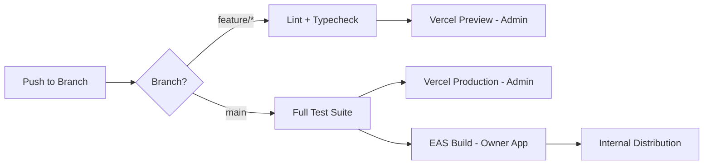

# Badminton Manager — Mobile & Deployment Strategy

## Part A: Owner App — React Native (Expo)

### 1. Platform Strategy

| Aspect | Decision |
|--------|---------|
| **Framework** | React Native + Expo SDK 52 |
| **Primary platform** | Android |
| **Secondary platform** | iOS |
| **Navigation** | Expo Router 4.x (file-based) |
| **Styling** | NativeWind 4.x (Tailwind for RN) |
| **Distribution** | Expo EAS Build + EAS Submit |

### 2. Shared vs Platform-Specific

| Layer | Shared (`packages/shared/`) | Platform-Specific |
|-------|---------------------------|-------------------|
| **Types** | `types/database.ts`, `types/api.ts` | N/A |
| **Services** | All Supabase service modules | N/A |
| **Validation** | Zod schemas | N/A |
| **Utils** | Formatters, constants | N/A |
| **Auth logic** | Supabase auth flow | Storage adapter (SecureStore for mobile, localStorage for web) |
| **Navigation** | N/A | Expo Router (mobile), React Router (admin web) |
| **UI Components** | Component API (props/types) | Full implementation (RN ≠ web) |
| **Notifications** | N/A | expo-notifications (mobile only) |
| **Camera** | N/A | expo-image-picker (mobile only) |
| **Offline** | N/A | MMKV (mobile only) |
| **Maps** | N/A | Google Maps link (no in-app map for MVP) |

### 3. Mobile-Specific Features

| Feature | Technology | Priority |
|---------|-----------|----------|
| Push notifications | expo-notifications + FCM | MVP |
| Photo capture | expo-image-picker | MVP |
| Secure auth storage | expo-secure-store | MVP |
| Offline cache | react-native-mmkv | MVP |
| PDF receipts | expo-print | MVP |
| WhatsApp deep links | react-native Linking | MVP |
| Share receipts | expo-sharing | MVP |
| Biometric auth | expo-local-authentication | Phase 2 |
| Deep linking | expo-linking + app.json scheme | Phase 2 |
| Haptic feedback | expo-haptics | Nice-to-have |

### 4. Offline Strategy

| Data | Offline Behavior |
|------|-----------------|
| Today's schedule | ✅ Cache in MMKV, show with "offline" banner |
| Member list | ✅ Cache in MMKV, read-only |
| New bookings | ❌ Blocked — requires internet |
| Payment recording | ❌ Blocked — requires internet |
| Reports | ❌ Not available offline |

### 5. EAS Build Configuration

```json
{
  "build": {
    "development": {
      "developmentClient": true,
      "distribution": "internal",
      "channel": "development"
    },
    "preview": {
      "distribution": "internal",
      "channel": "preview"
    },
    "production": {
      "channel": "production"
    }
  },
  "submit": {
    "production": {
      "android": {
        "serviceAccountKeyPath": "./google-services.json"
      },
      "ios": {
        "appleId": "...",
        "ascAppId": "..."
      }
    }
  }
}
```

---

## Part B: Admin Panel — React Web

### 1. Platform Strategy

| Aspect | Decision |
|--------|---------|
| **Framework** | React 19 + Vite 8 |
| **Styling** | Tailwind CSS 4.x |
| **Layout** | Desktop-first (sidebar + content) |
| **Auth** | Email + password (Supabase Auth) |
| **Deployment** | Vercel |

### 2. Admin Panel Features

| Feature | Description |
|---------|------------|
| Venue management | Create, edit, deactivate venues |
| Court management | Create, edit courts per venue |
| Owner management | View owner accounts, assign to venues |
| Initial data setup | Feed venue/court info into DB |
| Dashboard | Aggregate stats (total venues, owners, bookings) |

---

## Part C: Monorepo Structure

```
VMS/
├── apps/
│   ├── owner/          # React Native (Expo) — Owner mobile app
│   └── admin/          # React + Vite — Admin web panel
├── packages/
│   └── shared/         # Shared types, services, validators, utils
├── supabase/           # Backend (migrations, edge functions, seed)
├── documents/          # Documentation
├── reference/          # Archived Figma export (temporary)
├── package.json        # Workspace root
├── pnpm-workspace.yaml
└── tsconfig.base.json
```

---

## Part D: Deployment Strategy

### 1. Environment Architecture

| Environment | Owner App | Admin Panel | Backend |
|-------------|-----------|-------------|---------|
| Development | Expo Dev Client (local) | localhost:5173 | Supabase (cloud project) |
| Preview | EAS internal build | Vercel preview | Same Supabase project |
| Production | EAS production build | Vercel production | Same Supabase project |

### 2. Environment Variables

| Variable | Owner App | Admin Panel |
|----------|-----------|-------------|
| `SUPABASE_URL` | app.json extra | VITE_SUPABASE_URL |
| `SUPABASE_ANON_KEY` | app.json extra | VITE_SUPABASE_ANON_KEY |
| `APP_ENV` | EAS channel | VITE_APP_ENV |

### 3. CI/CD Pipeline



### 4. Monitoring

| Concern | Tool |
|---------|------|
| Error tracking | Sentry (both apps) |
| Analytics | PostHog or Mixpanel |
| Performance | Expo Insights (mobile) |
| Uptime | BetterUptime (admin panel) |
| Logs | Supabase Dashboard |

### 5. Release Strategy

| Phase | Owner App (Mobile) | Admin Panel (Web) |
|-------|-------------------|------------------|
| Dev | Expo Go / Dev Client | Vite dev server |
| Preview | EAS internal distribution | Vercel preview deploy |
| Production | EAS Submit to stores | Vercel production |
| Hotfix | OTA update (EAS Update) | Merge to main |

### 6. Versioning

- Semantic versioning: `MAJOR.MINOR.PATCH`
- Owner App: `app.json` version + build number
- Admin Panel: `package.json` version
- Database: Sequential migration files (`001_initial.sql`, `002_bookings.sql`, etc.)