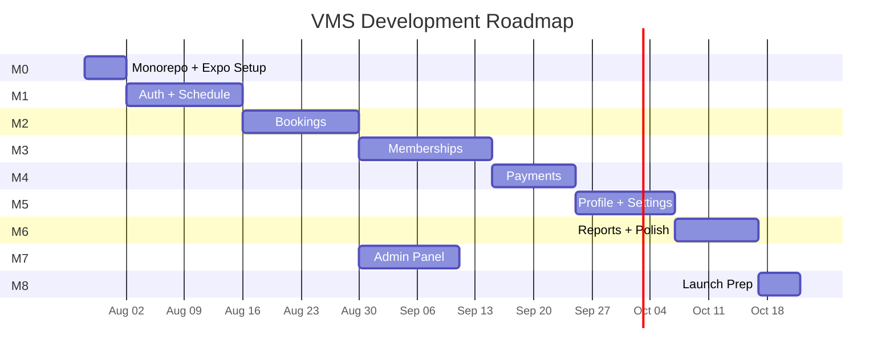

# Badminton Manager — Development Roadmap

## Architecture

| App | Platform | Technology |
|-----|----------|-----------|
| **Owner App** | Mobile (Android/iOS) | React Native + Expo |
| **Admin Panel** | Web (Desktop) | React + Vite + Tailwind |
| **Backend** | Cloud | Supabase (shared) |

## Milestone Overview

> [!NOTE]
> **M7 (Admin Panel) can start in parallel with M3** since it only depends on core tables from M0-M1.

---

## Milestone 0 — Monorepo + Expo Setup

**Duration:** ~1 week | **Complexity:** ⬛⬛⬜⬜⬜ (Low)

### Objectives
- Set up pnpm monorepo with all apps and packages
- Initialize Expo project for Owner App
- Configure Supabase and create initial schema
- Build core UI component library
- Archive Figma export code

### Deliverables

**Monorepo:**
- [ ] pnpm workspace (`apps/owner/`, `apps/admin/`, `packages/shared/`)
- [ ] Root `package.json`, `pnpm-workspace.yaml`, `tsconfig.base.json`
- [ ] Updated `.gitignore`, `AGENTS.md`
- [ ] Archive Figma code to `reference/figma-src/` and `reference/prompts/`
- [ ] Remove empty `Owner app/` dir, `CLAUDE.md`, stale lockfiles

**Owner App (`apps/owner/`):**
- [ ] Expo project with Expo Router
- [ ] NativeWind (Tailwind for React Native)
- [ ] Path aliases (`@/`, `@vms/shared`)
- [ ] Install: React Query, Zustand, React Hook Form, Zod, date-fns
- [ ] Design tokens (colors, fonts, spacing from Figma reference)
- [ ] Core UI: Button, Card, Input, Badge, StatusChip, Skeleton, EmptyState, ErrorState
- [ ] Layout: custom TabBar, PageHeader, SafeArea wrapper
- [ ] Overlays: @gorhom/bottom-sheet, Dialog, FABMenu
- [ ] Auth guard in root layout
- [ ] Verify on physical device (Expo Go)

**Shared Package (`packages/shared/`):**
- [ ] TypeScript package with barrel exports
- [ ] Supabase client init (env-aware: SecureStore vs localStorage)
- [ ] Placeholder types, utils, constants
- [ ] Utility functions: `formatCurrency()`, `formatDate()`, `formatPhone()`

**Supabase:**
- [ ] Install Supabase CLI
- [ ] Link to existing project
- [ ] Migration 001: enums, owners, venues, courts
- [ ] Basic RLS policies
- [ ] Generate TypeScript types

**Admin Stub (`apps/admin/`):**
- [ ] Minimal Vite + React + Tailwind skeleton

### Completion Checklist
- [ ] `pnpm dev:owner` → Expo starts, viewable on device
- [ ] `pnpm build:admin` → Vite produces build
- [ ] Owner app imports from `@vms/shared` work
- [ ] Supabase connection verified
- [ ] All core UI components render

---

## Milestone 1 — Authentication + Schedule

**Duration:** ~2 weeks | **Complexity:** ⬛⬛⬛⬜⬜ (Medium)

### Deliverables
- [ ] Login screen: phone input + OTP (Supabase Auth)
- [ ] Token storage: expo-secure-store
- [ ] Session persistence + auto-refresh + logout
- [ ] Owner profile creation on first login
- [ ] Venues + courts CRUD + seed data
- [ ] Venue selector (Zustand global state, persistent)
- [ ] Schedule screen: horizontal timeline grid
- [ ] Court rows × time columns (:00/:30 intervals, 6AM-10PM)
- [ ] Color-coded slot rendering (7 types including Membership)
- [ ] Slot tap → bottom sheet with actions
- [ ] Week-view date selector
- [ ] Operating schedules + pricing blocks (migration 002)
- [ ] RLS policies for all M1 tables
- [ ] Multi-device support (max 4 concurrent sessions)

### Completion Checklist
- [ ] New user can register and land on Schedule
- [ ] Returning user auto-authenticated
- [ ] Venue selector shows all owner venues, switching refreshes data
- [ ] Schedule displays courts × time grid correctly
- [ ] Tapping slot opens bottom sheet

---

## Milestone 2 — Bookings

**Duration:** ~2 weeks | **Complexity:** ⬛⬛⬛⬜⬜ (Medium)

### Deliverables
- [ ] Customers table + search + create (migration 003)
- [ ] Bookings table with constraints (start :00/:30, whole-hour duration)
- [ ] Bookings list: tabs (Upcoming/Ongoing/Completed/Cancelled)
- [ ] Search by name, phone, booking ID
- [ ] Filter by court, date
- [ ] BookingCard component
- [ ] Booking detail screen
- [ ] Payment status update: dropdown (Pending→Partial→Paid→Refunded→Cancelled) + note
- [ ] 5-step booking wizard with price auto-calc + override + flat discount
- [ ] Status transitions (upcoming → ongoing → completed)
- [ ] Cancel with confirmation
- [ ] Move booking (change time/court)
- [ ] Hard-block overlapping bookings + owner force-book override
- [ ] Schedule → New Booking + FAB → New Booking
- [ ] Booking source: Offline/Walk-in (immutable)
- [ ] WhatsApp deep link for confirmation
- [ ] RLS policies

### Completion Checklist
- [ ] Can create booking from schedule or FAB
- [ ] Booking appears on schedule grid
- [ ] Can search, filter, complete, cancel, edit bookings
- [ ] Price calculated correctly, owner can override
- [ ] Payment status changeable post-creation
- [ ] Double-booking prevented

---

## Milestone 3 — Membership Management

**Duration:** ~2.5 weeks | **Complexity:** ⬛⬛⬛⬛⬜ (High)

### Deliverables
- [ ] Membership slots CRUD (migration 004)
- [ ] Members add/edit/remove
- [ ] Members screen: 4 tabs (Slots, Applications, Guest Play, Members)
- [ ] Summary KPI cards
- [ ] Slots tab: cards with capacity bar, open/close toggle
- [ ] Create/edit slot forms with initial members
- [ ] Slot members view with active/inactive toggle
- [ ] Member transfer between slots
- [ ] Membership applications: accept/reject/invite-to-guest-play
- [ ] Guest play: upcoming/completed, accept-as-member
- [ ] Capacity enforcement
- [ ] Membership slots pre-block on schedule
- [ ] Release slot for specific date (membership_slot_releases table)
- [ ] RLS policies

### Completion Checklist
- [ ] Can create slot with all fields + initial members
- [ ] Can manage members (add/edit/transfer/remove/toggle)
- [ ] Membership blocks appear on schedule
- [ ] Can release slot for specific date
- [ ] Capacity limits enforced

---

## Milestone 4 — Membership Payments

**Duration:** ~1.5 weeks | **Complexity:** ⬛⬛⬛⬜⬜ (Medium)

### Deliverables
- [ ] Membership payments table (migration 005)
- [ ] Auto-generate monthly payments (Edge Function cron)
- [ ] Payments screen: KPI dashboard
- [ ] Slot payment cards with collection progress
- [ ] Slot payments detail: member list with filter chips
- [ ] Mark as Paid bottom sheet (mode + date)
- [ ] Payment history per member
- [ ] Push notification reminder (expo-notifications + FCM)
- [ ] WhatsApp deep link reminder
- [ ] PDF receipt (expo-print)
- [ ] Inactive member payment suppression
- [ ] RLS policies

### Completion Checklist
- [ ] Monthly payments auto-generated for active members
- [ ] Can mark payments as paid with mode
- [ ] Dashboard KPIs update correctly
- [ ] Push notification + WhatsApp reminder work
- [ ] PDF receipt generates and can be shared

---

## Milestone 5 — Profile & Settings

**Duration:** ~1.5 weeks | **Complexity:** ⬛⬛⬛⬜⬜ (Medium)

### Deliverables
- [ ] Profile screen with menu items
- [ ] Court Information: view + edit (owner admin permission)
- [ ] Photo upload (expo-image-picker → Supabase Storage)
- [ ] Google Maps link
- [ ] Court type metadata (Wooden/Synthetic/Cement/Mat)
- [ ] Court Schedule & Pricing: weekly calendar, pricing blocks CRUD, copy day, close/24h
- [ ] Grow Your Business: 4 placeholder CTA pages
- [ ] Subscription & Billing: static mock from design
- [ ] Help & Support: FAQ accordion, contact, legal
- [ ] Account recovery: optional email backup
- [ ] Logout with confirmation

### Completion Checklist
- [ ] All profile menu items navigable
- [ ] Court info editable and persisted
- [ ] Photos upload and display
- [ ] Pricing blocks CRUD works
- [ ] Schedule copy-to-days works

---

## Milestone 6 — Reports + Polish

**Duration:** ~1.5 weeks | **Complexity:** ⬛⬛⬜⬜⬜ (Low-Medium)

### Deliverables
- [ ] Reports screen: period selector (Week/Month/Year)
- [ ] Revenue breakdown: Booking Revenue | Membership Revenue | Total
- [ ] Charts: revenue (bar/line), utilization, membership growth, payment split (pie)
- [ ] KPI cards with trend indicators
- [ ] CSV report export (expo-sharing)
- [ ] DB views/functions for report aggregation
- [ ] Loading skeletons on all screens
- [ ] Empty states on all lists
- [ ] Error boundaries with retry
- [ ] Toast notifications for all actions
- [ ] Form validation messages
- [ ] Offline: read-only MMKV cache for schedule + members
- [ ] Offline banner: "You're offline — showing cached data"
- [ ] Push notifications: FCM setup for all triggers
- [ ] Performance audit

### Completion Checklist
- [ ] All reports render with real data
- [ ] Loading/empty/error states everywhere
- [ ] Offline mode works (read-only cache + banner)
- [ ] Push notifications delivered correctly
- [ ] CSV export works

---

## Milestone 7 — Admin Panel

**Duration:** ~1.5 weeks | **Complexity:** ⬛⬛⬜⬜⬜ (Low-Medium)

> [!NOTE]
> Can start **in parallel with M3** (after M2 complete). Depends only on core tables from M0-M1.

### Deliverables
- [ ] Admin auth: email/password (Supabase)
- [ ] Admin RLS policies (super_admin role)
- [ ] Venues: create, edit, deactivate
- [ ] Courts: create, edit per venue
- [ ] Owners: view accounts, assign to venues
- [ ] Initial court info setup (feed into DB)
- [ ] Simple dashboard: aggregate stats (total venues, owners, bookings)
- [ ] Desktop-first layout: sidebar + content area
- [ ] Deploy to Vercel

### Completion Checklist
- [ ] Admin can log in with email/password
- [ ] Can create and configure venues + courts
- [ ] Can view and manage owner accounts
- [ ] Deployed to Vercel

---

## Milestone 8 — Launch Preparation

**Duration:** ~1 week | **Complexity:** ⬛⬛⬜⬜⬜ (Low)

### Deliverables
- [ ] Production Supabase: all migrations applied
- [ ] Production env variables configured
- [ ] Sentry error tracking (both apps)
- [ ] EAS Build config (Android APK/AAB, iOS IPA)
- [ ] Internal distribution testing (EAS)
- [ ] Admin panel: custom domain + SSL on Vercel
- [ ] Data seed script for demo/onboarding
- [ ] Final security audit (RLS, API keys)
- [ ] Performance testing with realistic data volume
- [ ] Supabase backup configuration
- [ ] Delete `reference/` directory (no longer needed)

### Completion Checklist
- [ ] Owner app installable on Android device
- [ ] Admin panel live at custom domain
- [ ] Error tracking receiving events
- [ ] Security audit passed
- [ ] Backups configured

---

## Timeline Summary

| Milestone | Duration | Complexity | Dependencies |
|-----------|----------|------------|-------------|
| M0: Setup | 1 week | Low | — |
| M1: Auth + Schedule | 2 weeks | Medium | M0 |
| M2: Bookings | 2 weeks | Medium | M1 |
| M3: Memberships | 2.5 weeks | High | M2 |
| M4: Payments | 1.5 weeks | Medium | M3 |
| M5: Profile | 1.5 weeks | Medium | M1 |
| M6: Reports + Polish | 1.5 weeks | Low-Medium | M1-M5 |
| M7: Admin Panel | 1.5 weeks | Low-Medium | M1 (parallel with M3+) |
| M8: Launch | 1 week | Low | All |
| **Total (sequential)** | **~14.5 weeks** | | |
| **Total (M7 parallel)** | **~13 weeks** | | |

> [!IMPORTANT]
> These estimates assume a **single developer** working full-time. M5 (Profile) can also start alongside M3 since it only depends on M1 data.

> [!WARNING]
> **Do not skip M0.** The monorepo setup, shared package, and Supabase schema are the foundation. Shortcuts here create integration debt that compounds in every later milestone.
