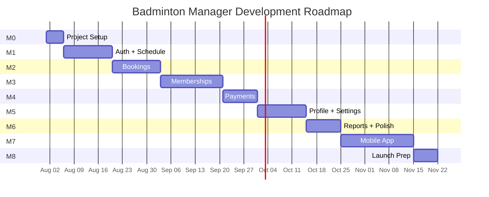

# Badminton Manager — Development Roadmap

## Milestone Overview

---

## Milestone 0 — Project Setup & Foundation

**Duration:** ~1 week
**Complexity:** ⬛⬛⬜⬜⬜ (Low)

### Objectives
- Set up production project structure
- Configure tooling, linting, CI
- Set up Supabase project
- Create design system foundation

### Deliverables
- [ ] Initialize Vite + React + TypeScript project (fresh, not from Figma export)
- [ ] Configure Tailwind CSS v4 with design tokens from existing `index.css`
- [ ] Install and configure: React Router, React Query, Zustand, React Hook Form, Zod, Sonner
- [ ] Set up Supabase project (development environment)
- [ ] Create initial database migration (core tables: owners, venues, courts)
- [ ] Configure Supabase client + typed client generation
- [ ] Set up Vercel project with preview deploys
- [ ] Configure ESLint + Prettier
- [ ] Build shared UI components: Button, Card, Input, Badge, StatusChip, Skeleton, EmptyState
- [ ] Build layout components: BottomNav, PageHeader, PageShell, BottomSheet
- [ ] Create basic routing skeleton with auth guard

### Dependencies
- Supabase account
- Vercel account
- Domain name (optional)

### Testing Strategy
- Verify dev server runs
- Verify Supabase connection
- Verify Vercel preview deploy
- Visual check: all shared components render correctly

### Completion Checklist
- [ ] `npm run dev` starts without errors
- [ ] `npm run build` produces production build
- [ ] Supabase tables created and accessible
- [ ] Auth guard redirects unauthenticated users
- [ ] All shared UI components exported and usable

---

## Milestone 1 — Authentication + Schedule

**Duration:** ~2 weeks
**Complexity:** ⬛⬛⬛⬜⬜ (Medium)

### Objectives
- Implement OTP login/logout
- Build the Schedule screen (heart of the app)
- Implement venue selector with data

### Deliverables
- [ ] Login page with phone input + OTP verification (Supabase Auth)
- [ ] Session management (persist, refresh, logout)
- [ ] Owners table + profile creation on first login
- [ ] Venues CRUD + seed data
- [ ] Courts CRUD + seed data
- [ ] Venue selector component (global state via Zustand)
- [ ] Schedule page: timeline grid, court rows, hourly columns
- [ ] Color-coded slots rendering from database
- [ ] Slot tap → bottom sheet with actions
- [ ] Week-view date selector
- [ ] Operating schedules + pricing blocks tables
- [ ] RLS policies for owners, venues, courts

### Dependencies
- Milestone 0 complete
- Supabase SMS provider configured (Twilio/MessageBird)

### Testing Strategy
- Manual: Full login flow (phone → OTP → schedule)
- Manual: Venue switching refreshes data
- Manual: Schedule renders correct for selected date
- Unit: Supabase service functions (mocked)

### Completion Checklist
- [ ] New user can register and land on Schedule
- [ ] Returning user auto-authenticated
- [ ] Venue selector shows all owner venues
- [ ] Schedule displays courts × time grid
- [ ] Tapping slot opens bottom sheet

---

## Milestone 2 — Bookings

**Duration:** ~2 weeks
**Complexity:** ⬛⬛⬛⬜⬜ (Medium)

### Objectives
- Build complete booking lifecycle
- Implement customer management
- Connect bookings to schedule

### Deliverables
- [ ] Customers table + search + create
- [ ] Bookings table with all fields
- [ ] Bookings list page with tabs (Upcoming/Ongoing/Completed/Cancelled)
- [ ] Search bookings (name, phone, ID)
- [ ] Filter bookings (court, date)
- [ ] Booking card component
- [ ] Booking detail page with all info
- [ ] 5-step booking wizard
- [ ] Price auto-calculation from pricing blocks
- [ ] Booking status transitions (upcoming → ongoing → completed)
- [ ] Cancel booking with confirmation
- [ ] Move booking (change time/court)
- [ ] Availability check (prevent double-booking)
- [ ] Schedule → New Booking integration
- [ ] FAB → New Booking integration
- [ ] RLS policies for bookings and customers

### Dependencies
- Milestone 1 complete (auth, schedule, venues, courts)

### Testing Strategy
- Manual: Complete booking flow from schedule
- Manual: Search and filter bookings
- Manual: Status transitions
- Manual: Double-booking prevention
- Unit: Price calculation function
- Unit: Availability check function

### Completion Checklist
- [ ] Can create booking from schedule or FAB
- [ ] Booking appears on schedule grid
- [ ] Can filter and search bookings
- [ ] Can complete, cancel, and edit bookings
- [ ] Price calculated correctly from pricing blocks

---

## Milestone 3 — Membership Management

**Duration:** ~2.5 weeks
**Complexity:** ⬛⬛⬛⬛⬜ (High)

### Objectives
- Build complete membership system
- Implement slot lifecycle
- Handle applications and guest play

### Deliverables
- [ ] Membership slots CRUD
- [ ] Members table + add/edit/remove
- [ ] Members page with 4 tabs
- [ ] Summary dashboard cards (KPIs)
- [ ] Slots tab: slot cards with capacity bar, open/close toggle
- [ ] Create slot form with initial members
- [ ] Edit slot form
- [ ] Slot members view: member cards with active toggle
- [ ] Member transfer between slots
- [ ] Membership applications table + UI
- [ ] Accept/reject/invite-to-guest-play actions
- [ ] Guest play table + UI (upcoming/completed)
- [ ] Accept guest as member flow
- [ ] Capacity enforcement
- [ ] RLS policies for membership tables

### Dependencies
- Milestone 2 complete (customers table shared with bookings)

### Testing Strategy
- Manual: Full slot creation with initial members
- Manual: Add/edit/remove members from slot
- Manual: Transfer member between slots
- Manual: Active/inactive toggle behavior
- Manual: Application review flow
- Manual: Guest play → accept as member
- Unit: Capacity enforcement logic

### Completion Checklist
- [ ] Can create membership slot with all fields
- [ ] Can manage members within a slot
- [ ] Can review and act on applications
- [ ] Can manage guest play sessions
- [ ] Capacity limits enforced

---

## Milestone 4 — Membership Payments

**Duration:** ~1.5 weeks
**Complexity:** ⬛⬛⬛⬜⬜ (Medium)

### Objectives
- Build payment tracking for memberships
- Implement payment recording workflow

### Deliverables
- [ ] Membership payments table
- [ ] Auto-generate monthly payment records (Edge Function cron)
- [ ] Payments page: KPI dashboard cards
- [ ] Slot payment cards with collection progress
- [ ] Slot payments detail page: member payment list
- [ ] Filter chips (All/Paid/Pending/Overdue)
- [ ] Mark as Paid bottom sheet (payment mode + date)
- [ ] Payment history per member
- [ ] Send reminder action (WhatsApp deep link or SMS)
- [ ] Download receipt (PDF generation via Edge Function)
- [ ] Inactive member payment suppression
- [ ] RLS policies for payments

### Dependencies
- Milestone 3 complete (membership slots and members)

### Testing Strategy
- Manual: Monthly payment generation
- Manual: Mark as paid flow
- Manual: Filter by status
- Manual: Payment history display
- Unit: Payment status transitions
- Unit: Inactive member exclusion

### Completion Checklist
- [ ] Monthly payments auto-generated for active members
- [ ] Can mark payments as paid with mode
- [ ] Dashboard KPIs update correctly
- [ ] Payment history accessible per member

---

## Milestone 5 — Profile & Settings

**Duration:** ~2 weeks
**Complexity:** ⬛⬛⬛⬜⬜ (Medium)

### Objectives
- Build all profile sub-screens
- Implement court configuration

### Deliverables
- [ ] Profile page with menu items
- [ ] Court Information page (view + edit mode)
- [ ] Photo upload to Supabase Storage
- [ ] Google Maps integration (view + link)
- [ ] Court Schedule & Pricing page
- [ ] Weekly calendar preview with pricing blocks
- [ ] Add/edit/delete pricing blocks
- [ ] Copy day's schedule to other days
- [ ] Close/24h/Reopen day toggles
- [ ] Grow Your Business landing pages (4 promo pages)
- [ ] Subscription & Billing page (static for now)
- [ ] Help & Support page (FAQ accordion, contact info, legal)
- [ ] Logout flow with confirmation

### Dependencies
- Milestone 1 complete (venues, courts, operating schedules)

### Testing Strategy
- Manual: Edit court info and verify persistence
- Manual: Upload and view photos
- Manual: Create/edit/delete pricing blocks
- Manual: Copy schedule between days
- Manual: Navigate all profile sub-screens

### Completion Checklist
- [ ] All profile menu items navigable
- [ ] Court info editable and persisted
- [ ] Photos upload and display correctly
- [ ] Pricing blocks create/edit/delete work
- [ ] Schedule copy-to-days works

---

## Milestone 6 — Reports & Polish

**Duration:** ~1.5 weeks
**Complexity:** ⬛⬛⬜⬜⬜ (Low-Medium)

### Objectives
- Build reporting dashboard
- Polish UI, error handling, edge cases

### Deliverables
- [ ] Reports page with period selector
- [ ] Revenue charts (bar + line via Recharts)
- [ ] Court utilization bars
- [ ] Membership growth trend
- [ ] Payment split pie chart
- [ ] KPI cards with trend indicators
- [ ] Database views/functions for report aggregation
- [ ] Loading skeletons on all pages
- [ ] Empty states on all list views
- [ ] Error boundaries with retry
- [ ] Toast notifications for all actions
- [ ] Form validation messages
- [ ] Pull-to-refresh (mobile prep)
- [ ] Performance audit (bundle size, lazy loading)

### Dependencies
- Milestones 1–5 complete (data to report on)

### Testing Strategy
- Manual: Reports show correct data after bookings/payments
- Manual: Loading and empty states display correctly
- Manual: Error recovery works
- Performance: Lighthouse audit

### Completion Checklist
- [ ] All reports render with real data
- [ ] Loading states on every data-fetching page
- [ ] Empty states on every list
- [ ] Error boundaries catch and display errors
- [ ] Lighthouse performance score > 80

---

## Milestone 7 — Mobile App (React Native / Expo)

**Duration:** ~3 weeks
**Complexity:** ⬛⬛⬛⬛⬜ (High)

### Objectives
- Port web app to React Native
- Implement mobile-specific features

### Deliverables
- [ ] Set up Expo project with shared packages
- [ ] Implement all screens using React Native components
- [ ] React Navigation tab + stack navigation
- [ ] Expo SecureStore for auth tokens
- [ ] Push notifications setup (expo-notifications)
- [ ] Camera integration for photos (expo-image-picker)
- [ ] Deep linking configuration
- [ ] Platform-specific UI adjustments
- [ ] EAS Build configuration
- [ ] Internal distribution for testing

### Dependencies
- Milestones 0–6 complete (web app functional)

### Testing Strategy
- Manual: Full app walkthrough on iOS and Android
- Manual: Push notification delivery
- Manual: Photo capture and upload
- Device: Test on at least 2 different screen sizes

### Completion Checklist
- [ ] App runs on iOS and Android via Expo
- [ ] All features match web functionality
- [ ] Push notifications work
- [ ] Photos capture and upload

---

## Milestone 8 — Launch Preparation

**Duration:** ~1 week
**Complexity:** ⬛⬛⬜⬜⬜ (Low)

### Objectives
- Prepare for production launch
- Set up monitoring and analytics

### Deliverables
- [ ] Production Supabase project with final migrations
- [ ] Production environment variables on Vercel
- [ ] Sentry error tracking configured
- [ ] Analytics integration (PostHog/Mixpanel)
- [ ] Custom domain + SSL
- [ ] App store listings (if submitting mobile)
- [ ] Data seed script for demo/onboarding
- [ ] User documentation / onboarding guide
- [ ] Final security audit (RLS policies, API keys, CORS)
- [ ] Performance testing with realistic data volume
- [ ] Backup strategy for Supabase

### Dependencies
- All previous milestones complete

### Testing Strategy
- End-to-end: Complete user journey on production
- Security: Attempt unauthorized data access
- Performance: Load test with 100+ bookings, 50+ members

### Completion Checklist
- [ ] Production site live and accessible
- [ ] Error tracking receiving events
- [ ] Analytics tracking user actions
- [ ] Mobile app submitted to stores (or distributed internally)
- [ ] Backups configured and tested

---

## Complexity Summary

| Milestone | Duration | Complexity | Risk |
|-----------|----------|------------|------|
| M0: Setup | 1 week | Low | Low |
| M1: Auth + Schedule | 2 weeks | Medium | Medium (SMS provider) |
| M2: Bookings | 2 weeks | Medium | Low |
| M3: Memberships | 2.5 weeks | High | Medium (complex state) |
| M4: Payments | 1.5 weeks | Medium | Low |
| M5: Profile | 2 weeks | Medium | Low |
| M6: Reports + Polish | 1.5 weeks | Low-Medium | Low |
| M7: Mobile | 3 weeks | High | High (platform differences) |
| M8: Launch | 1 week | Low | Medium (production issues) |
| **Total** | **~16 weeks** | | |

> [!IMPORTANT]
> **Do not begin a later milestone until the preceding milestone is complete.** Each milestone builds on the data and features of the previous one. Skipping ahead will create integration problems.

> [!NOTE]
> These estimates assume a **single developer** working full-time. With a team of 2-3, the timeline can be compressed to ~10-12 weeks by parallelizing non-dependent work (e.g., M5 Profile can start alongside M3 Memberships since it only depends on M1).
